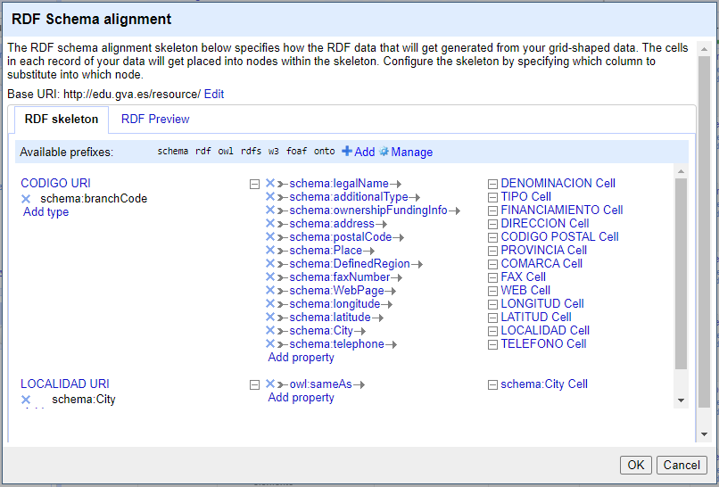
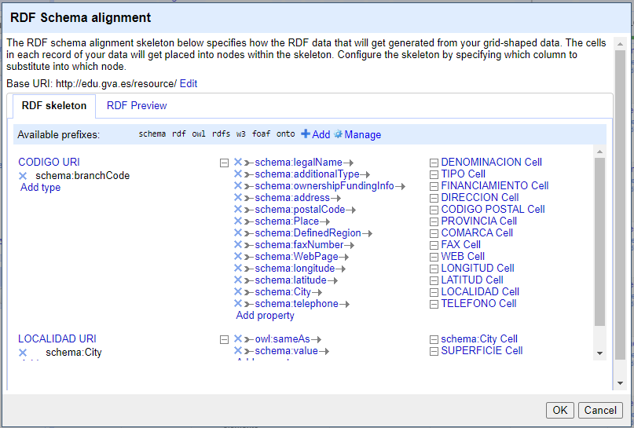

# Memoria del proyecto final

**Asignatura:** Web Semántica y Datos Enlazados.

**Autor:** Jose Manuel Gordon Sahuquillo

### Índice
* [1 - Introducción.](#1---introducción)
* [2 - Proceso de transformación](#2---proceso-de-transformación)
  * [2.1 - Selección de la fuente de datos](#21---selección-de-la-fuente-de-datos)
  * [2.2 - Análisis de los datos](#22---análisis-de-los-datos)
  * [2.3 - Estrategia de nombrado](#23---estrategia-de-nombrado)
  * [2.4 - Desarrollo del vocabulario](#24---desarrollo-del-vocabulario)
    * [2.4.1 - Especificación de los requisitos a satisfacer](#241---especificación-de-los-requisitos-a-satisfacer)
    * [2.4.2 - Construcción de un glosario de términos](#242---construcción-de-un-glosario-de-términos) 
    * [2.4.3 - Organización y estructuración de la información para el establecimiento de un modelo inicial](#243---organización-y-estructuración-de-la-información-para-el-establecimiento-de-un-modelo-inicial)
    * [2.4.4 - Búsqueda y selección de ontologías para su reutilización](#244---búsqueda-y-selección-de-ontologías-para-su-reutilización)
  * [2.5 - Proceso de transformación](#25---proceso-de-transformación)
  * [2.6 - Enlazado](#26---enlazado)
  * [2.7 - Publicación](#27---publicación)
* [3 - Aplicación y explotación](#3---aplicación-y-explotación)
* [4 - Conclusiones](#4---conclusiones)
* [5 - Bibliografía](#5---bibliografía)

  

## 1 - Introducción.
Este documento presenta la memoria del proyecto final correspondiente a la asignatura de Web Semántica y Datos Enlazados del Máster Universitario en Investigación en Inteligencia Artificial.

La Web Semántica y los Datos Enlazados son conceptos que están estrechamente relacionados, ya que ambos están enfocados en optimizar la organización y presentación de la información en la web con el objetivo de hacerla más accesible y comprensible para las máquinas y las personas.

El propósito de este trabajo es aplicar los diversos conocimientos adquiridos a lo largo del curso con el objetivo de cumplir los objetivos mencionados anteriormente. Para ello, se ha seleccionado el conjunto de datos "Centros docentes de la Comunitat Valenciana" el cual almacena los registros correspondientes a los centros docentes públicos, privados concertados y privados que existen en la Comunidad Valenciana de educación infantil, primaria, especial, secundaria, bachillerato, formación profesional, educación para personas adultas, enseñanzas de régimen especial(escuelas oficiales de idiomas, música y danza, artes plásticas y diseño, arte dramático y enseñanzas deportivas) y sistemas extranjeros.

Siguiendo las metodologías establecidas en el curso, se llevará a cabo la transformación de estos datos en un conjunto de datos enlazados, lo que nos permitirá aprovechar al máximo su potencial y facilitará su integración, consulta y análisis en diversos contextos y aplicaciones.

## 2 - Proceso de transformación.
Los siguientes apartados tienen como objetivo describir todo el proceso de transformación de los datos. En primer lugar, se empezará tratando el proceso de selección de la fuente de datos, donde se elegirá una fuente que nos permita completar correctamente este proyecto. Una vez elegida la fuente, pasaremos a realizar un análisis de los datos con el objetivo de comprender su estructura y su contenido.

Una vez completadas las dos primeras fases, pasaremos a la estrategia de nombrado, donde se indicará la estrategia que se va a seguir para el desarrollo del proyecto. Posteriormente, pasaremos al desarrollo del vocabulario, donde se definirán los términos y relaciones.

Tras las fases anteriores, donde se establecerán las bases del proyecto, se iniciará el proceso de transformación, donde se procederá a hacer una limpieza de los datos y prepararlos correctamente para que se puedan explotar adecuadamente.

Continuaremos el trabajo hablando de la fase de enlazado, donde se describirá el proceso que se ha llevado a cabo para enlazar los datos.

Por último, hablaremos de la fase de publicación, donde se estudiará la conveniencia de realizar este proceso.

## 2.1 - Selección de la fuente de datos.
Los datos que se han seleccionado para la transformación provienen del portal de datos abiertos de la Generalitat Valenciana. En concreto, se han seleccionado los siguientes datos: https://dadesobertes.gva.es/es/dataset/edu-centros.

La selección de este dataset se ha basado principalmente en los siguientes motivos:
* Es un dataset que representa un escenario real.
* Los datos son públicos y accesibles.
* Es un conjunto de datos actualizado y con una frecuencia de actualización semanal.
* Son datos relevantes para el conjunto de la población.

Por estos motivos se ha elegido este conjunto de datos por encima de otros que existen disponibles en la web de datos abiertos de la Generalitat Valenciana, ya que es un conjunto de datos que permitirá generar unos datos útiles.

## 2.2 - Análisis de los datos.
En primer lugar empezaremos analizando la licencia que tiene el conjunto de datos de origen. Como podemos ver en la web de datos abiertos, nos encontramos con una licencia tipo "Creative Commons Attribution" o lo que es lo mismo, una licencia CC BY 4.0. Esta licencia permite la modificación, redistribución y reutilización de los datos, incluso con fines comerciales, siempre y cuando se reconozca expresamente la autoría original de los datos que en este caso corresponde a la Conselleria de Educación, Universidades y Empleo de la Generalitat Valenciana.

Dado el carácter del proyecto y teniendo en cuenta que el objetivo final es crear un modelo que pueda ser reutilizable por otras personas considero que la licencia resultante del proyecto tiene que ser también CC BY 4.0, ya que así podemos permitir a otras personas compartir, usar y trabajar sobre el proyecto de forma libre, pero dejando patente la autoría del proyecto.

El siguiente paso es realizar un análisis exploratorio de los datos que componen el dataset. Para ello usaremos la herramienta Open Refine. Vemos que el conjunto de datos de origen tiene un total de 3773 registros que se encuentran distribuidos en 23 campos, los cuales los podemos describir de la siguiente forma:

| Campo    | Tipo de dato | Descripción del campo   |
|-----------|------|----------|
| CODIGO | numeric | Es un identificador único que identifica al centro docente.|
| DENOMINACION_GENERICA_ES | text | Hace referencia al tipo de centro docente en castellano.|
| DENOMINACION_GENERICA_VAL | text | Hace referencia al tipo de centro docente en valenciano.|
| DENOMINACION_ESPECIFICA | text | Es el nombre del centro propiamente dicho |
| DENOMINACION | text | Es un campo que junta la  denominación genérica del centro con "DENOMINACION_ESPECIFICA". |
| REGIMEN | text | Este campo es la abreviatura del régimen jurídico al que está adscrito el centro docente.|
| TIPO_VIA | text | Indica el tipo de vía donde se encuentra el centro docente. |
| DIRECCION | text | Indica la dirección donde se encuentra el centro docente. |
| NUMERO | text | Indica el numero correspondiente a la dirección del centro docente. |
| CODIGO_POSTAL | numeric | Indica el código postal donde se encuentra el centro docente.|
| LOCALIDAD | text | Este campo nos indica en qué localidad se encuentra el centro. |
| PROVINCIA | text | Indica el nombre de la provincia.|
| TELEFONO | numeric | Indica el número de teléfono del centro educativo.|
| FAX | numeric | Indica el número del fax del centro educativo.|
| COD_EDIFICACION | numeric | Indica el código de edificación.|
| LONGITUD | numeric | Indica la coordenada correspondiente a la longitud.|
| LATITUD | numeric | Indica la coordenada correspondiente a la latitud.|
| TITULARIDAD | text | Indica la titularidad del centro docente.|
| CIF | text | Indica el CIF centro docente.|
| COMARCA | text | Indica la comarca en la que se encuentra el centro docente.|
| URL_ES | text | Nos indica la dirección web del centro docente que contiene toda su información en castellano.|
| URL_VA | text | Nos indica la dirección web del centro docente que contiene toda su información en valenciano.|

En cuanto a la composición de los datos propiamente dicha tenemos los siguientes valores:
* **CODIGO:** Existen 3773 valores diferentes, siendo estos valores únicos que siguen un patrón específico para su formación, ya que todos empiezan por 12 si son de la provincia de Castellón, 03 si son de la provincia de Alicante o 46 si son de la provincia de Valencia. El resto de la numeración es un código que asigna la Conselleria.
* **DENOMINACION_GENERICA_ES:** Hace referencia a alguno de los 71 tipos de denominación que puede tomar el centro. Hay valores entre [CENTRO ADMINISTRATIVO, ..., UNIVERSIDAD]. Estos datos están en valenciano.
* **DENOMINACION_GENERICA_VAL:** Tiene el mismo tipo de datos que "DENOMINACION_GENERICA_ES" pero en este caso está escrito en valenciano.
* **DENOMINACION_ESPECIFICA:** Hay un total de 3234 nombres diferentes, que van desde [AGENCIA VALENCIAN DE TURISMO, ..., UV - ESCUELA UNIVERSITARIA DE MAGISTERIO AUSIAS MARCH]
* **DENOMINACION:** En este caso tenemos los mismo valores que en caso anterior.
* **REGIMEN:** Puede tomar los valores de [OTROS, PRIV, PRIV. CONC. y PÚB].
* **TIPO_VIA:** Hay 34 valores diferentes, los cuales pueden estar comprendidos entre [ALBEREDA, ..., URBANITZACIÓ]. Estos datos están únicamente en valenciano.
* **DIRECCION:** Existen 2508 valores diferentes. Puede tomar valores entre [1 DE MAIG, ...,ZURBARÁN (RESIDENCIAL LA LOMA)]. Existen también valores como "." y "Desconocido".
* **NUMERO:** Existen 290 valores diferentes. En algunos casos el valor es únicamente numérico y en otros se acompaña de letras. También tenemos valores "S/N", "s/n" y otros en blanco.
* **CODIGO_POSTAL:** Tenemos 502 valores diferentes. Los dos primeros dígitos son el código de la provincia, así que si empiezan por 12 son de la provincia de Castellón, 03 si son de la provincia de Alicante o 46 si son de la provincia de Valencia. Las tres cifras restantes indican la zona postal.
* **LOCALIDAD:** Toma alguno de los 472 nombres en valenciano de localidades que tienen centros docentes en la Comunitat Valenciana. El rango se encuentra desde [ADEMUZ, ..., ZUCAINA]. Existiendo dos valores en blanco. 
* **PROVINCIA:** Toma los valores en castellano y valenciano de las provincias de la Comunitat Valenciana con el rango [ALICANTE/ALACANT, CASTELLÓN/CASTELLÓ, VALENCIA/VALÈNCIA]. Existen dos valores en blanco.
* **TELEFONO:** Existen 3563 registros diferentes. En este caso tenemos tanto teléfonos fijos, como móviles. Incluyendo 75 registros en blanco.
* **FAX:** Existen 747 registros diferentes. En este caso tenemos 2972 registros en blanco.
* **COD_EDIFICACION:** Toma los valores de [1, 2]. Incluye 85 valores en blanco.
* **LONGITUD:** Existen 3588 valores diferentes en un rango [-0.00166, ..., 0.479343]. Existen 86 valores en blanco.
* **LATITUD:** Existen 3595 valores diferentes en un rango [37.856986, ..., 40.644417]. Existen 86 valores en blanco.
* **TITULARIDAD:** Toma los valores de [GENERALITAT VALENCIANA, NO CONSTA, PRIVADA]. Existen 9 valores en blanco.
* **CIF:** Existen 3302 valores diferentes. Nos encontramos con 90 valores que tienen como registro "-1".
* **URL_ES:** Existen 3373 valores diferentes. Todos empiezan con el formato "https://www.ceice.gva.es/web/centros-docentes/ficha-centro?codi=xxxxxx". Donde "xxxxxx" hace referencia al número del centro educativo. Siendo este enlace para centros en castellano.
* **URL_VA:** Existen 3373 valores diferentes. Todos empiezan con el formato "https://www.ceice.gva.es/va/web/centros-docentes/ficha-centro?codi=xxxxxx". Donde "xxxxxx" hace referencia al número del centro educativo. Siendo este enlace para centros en valenciano.

Como se puede ver, en este caso tenemos algunos campos en blanco que se deberán revisar más adelante. También será interesante corregir los datos donde aparecen valores tipo "-1" o valores iguales como "S/N" y "s/n". 

También habrá que revisar las direcciones web asociadas a los centros, ya que el formato de este cambió y esas web ya no existen como tal.

En general el dataset es bastante completo y tiene muchos datos interesantes que pueden ser de utilidad para transformar en datos enlazados. Los errores se corregirán más adelante en la fase de transformación de los datos.

En cuanto al identificador único, podemos concluir el análisis diciendo que el campo "CODIGO" nos servirá para poder identificar inequívocamente cada centro de forma individual, ya que estos registros son únicos.

## 2.3 - Estrategia de nombrado.
En este apartado definiremos cual será la estrategia de nombrado para nuestros recursos. En primer lugar tenemos que elegir la forma de las URIs, definiendo el uso que daremos a # y /. 

En nuestro caso, se ha decidido que usaremos la almohadilla (#) para los términos ontológicos y la barra inclinada (/) para los individuos.

El siguiente paso es elegir el dominio que usaremos. En nuestro caso, la aplicación del dominio va a ser a únicamente a nivel teórico, ya que no se dispone de la propiedad de ese dominio. En este caso la elección del dominio es la siguiente:
* **Dominio:** http://edu.gva.es/

A continuación. una vez se ha definido el dominio continuaremos definiendo la ruta que deben seguir las URIs en tal caso se realizará de la siguiente forma:

* **Ruta para términos ontológicos:** http://edu.gva.es/ontology/centro#
* **Ruta para individuos:** http://edu.gva.es/resource/

El siguiente paso es la elección de los patrones para los diferentes elementos de interés. En tal caso se seguirá el siguiente patrón:

* **Patrón para términos ontológicos:** http://edu.gva.es/ontology/centro#<term_name>. En este caso <term_name>  hará referencia a los distintos términos ontológicos que existan.

* **Patrón para individuos:** http://edu.gva.es/resource/<resource_type>/<resource_id>. En este caso <resource_type> hará referencia a un tipo de recurso existente, mientras que <resource_id> es el identificador único del recurso.
 
 
## 2.4 - Desarrollo del vocabulario.
Viendo el contenido del conjunto de datos que hemos seleccionado, la mejor columna para establecer las relaciones corresponde a los campos de la columna "CODIGO". Esto se debe a que los datos de esta columna son únicos y no se repiten en ningún otro registro. A partir de esta columna se han ido relacionando el resto de los datos que se disponen de los centros educativos (Denominación, régimen, dirección, número, código postal, etc.)

Para el proceso del desarrollo se han seguido los siguientes pasos según se establece en la temario del curso:

1. Especificar los requisitos que se deben satisfacer:
  * Funcionales.
  * No funcionales.
2. Construir un glosario de términos apoyados en:
  * Preguntas de competencia.
  * Los datos y su esquema.
  * Consulta de fuentes expertas.
3. Organizar y estructura la información para establecer un modelo inicial siguiendo los siguientes pasos:
  * Identificar dominios y conceptos claves.
  * Establecer jerarquías.
  * Definir relaciones entre elementos.
  * Identificar reglas, axiomas, etc.
4. Búsqueda y selección de ontologías que se puedan reutilizar.

## 2.4.1 - Especificación de los requisitos a satisfacer.
Este apartado tiene como objetivo establecer cuáles son los requisitos funcionales y no funcionales que la ontología debe cumplir para un correcto funcionamiento. Empezaremos definiendo los requisitos no funcionales, los cuales son:
* Reaprovechamiento de otras ontologías ya existentes.
* Utilizar un vocabulario soportado por el programa OpenRefine.
* Permitir la interoperabilidad entre diferentes sistemas.
* Garantizar la escalabilidad de la ontología.

En cuanto a los requisitos funcionales los obtendremos a través de las siguientes preguntas de competencia: 

| Código    | Pregunta|
|-----------|------|
| PC.1   | ¿Cuál es el código del centro?                                  |
| PC.2   | ¿Qué nombre tiene el centro?                                    |
| PC.3   | ¿Qué etapa educativa cubre el centro?                           |
| PC.4   | ¿Qué régimen jurídico tiene el centro?                          |
| PC.5   | ¿Quién ostenta la titularidad del centro?                       |
| PC.6   | ¿Cuál es el CIF del centro?                                     |
| PC.7   | ¿Cuál es la dirección completa del centro?                      |
| PC.8   | ¿En qué localidad se encuentra el centro?                        |
| PC.9   | ¿Cuál es la provincia del centro?                               |
| PC.10  | ¿En qué comarca se encuentra el centro?                          |
| PC.11  | ¿Cuáles son los medios de contacto que existen con el centro?    |
| PC.12  | ¿Cuál es la ubicación geográfica del centro? 

## 2.4.2 - Construcción de un glosario de términos.
En base a la definición de preguntas de competencia que se han realizado en el apartado anterior podemos definir el siguiente glosario de términos.
| Término    | Definición |
|-----------|------|
| Código | Es el código numérico que identifica al centro | 
| Denominación | Es el nombre completo del centro educativo |
| Tipo | Indica el tipo de enseñanza que proporciona el centro |
| Régimen jurídico | Es el régimen jurídico del centro |
| Titularidad | Indica la titularidad del centro |
| CIF | Indica el CIF del centro |
| Dirección | Indica la dirección del centro |
| Código postal | Indica el código postal del centro |
| Localidad | Indica la localidad del centro |
| Provincia | Indica la provincia del centro |
| Comarca | Indica la comarca del centro |
| Teléfono | Indica el teléfono del centro |
| Fax | Indica el fax del centro |
| Web | Indica la web del centro |
| Longitud | Indica la coordenada de longitud del centro  |
| Latitud | Indica la coordenada de latitud del centro |

## 2.4.3 - Organización y estructuración de la información para el establecimiento de un modelo inicial.
En base a los términos del apartado anterior y al esquema inicial se crea el siguiente mapa inicial que permite representar conceptualmente la ontología.


## 2.4.4 - Búsqueda y selección de ontologías para su reutilización.
En el siguiente apartado se buscarán diferentes ontologías que puedan ser reutilizadas. En concreto se ha preparado la siguiente tabla para mostrar claramente el trabajo realizado que se ha basado completamente en términos de https://schema.org/.

| Término    | URI |
|-----------|------|
| Código| https://schema.org/branchCode | 
| Denominación | https://schema.org/legalName |
| Tipo | https://schema.org/additionalType |
| Régimen jurídico | https://schema.org/ownershipFundingInfo |
| Titularidad | https://schema.org/funder |
| CIF | https://schema.org/taxID |
| Dirección | https://schema.org/address |
| Código postal | https://schema.org/postalCode |
| Localidad | https://schema.org/City |
| Provincia | https://schema.org/Place |
| Comarca | https://schema.org/DefinedRegion |
| Teléfono | https://schema.org/telephone |
| Fax | https://schema.org/faxNumber |
| Web | https://schema.org/WebPage |
| Longitud | https://schema.org/longitude  |
| Latitud | https://schema.org/latitude |

Se puede ver en la tabla que ha sido posible encontrar ontologías ya existentes que con su reutilización nos permitiría cubrir todas las necesidades que se han desarrollado anteriormente.

## 2.5 - Proceso de transformación.
En este apartado gracias a la herramienta de OpenRefine se van a realizar diferentes transformaciones en los datos originales con el objetivo de adecuarlos a los requisitos que se han establecido en el punto anterior. En concreto se realizaron los siguientes cambios:

* Las columnas "DENOMINACION_GENERICA_ES" y "DENOMINACION_GENERICA_VAL" contienen la misma información, pero una se encuentra en castellano y la otra en valenciano. La decisión respecto a estas columnas es eliminar "DENOMINACION_GENERICA_VAL" y transformar la columna de "DENOMINACION_GENERICA_ES" en "TIPO".

* Las columnas "DENOMINACION_ESPECIFICA" y "DENOMINACION" contienen exactamente la misma información. Tras revisar un fichero de centros que existe de 2020 esto no es correcto, ya que "DENOMINACION_ESPECIFICA" debería incluir solo el nombre del centro, mientras que "DENOMINACION" corresponde a la combinación del "Tipo centro" + "DENOMINACION_ESPECIFICA". Por ejemplo, si revisamos el primer caso que es "CEIP LA RAMBLA", en la  columna "DENOMINACION_ESPECIFICA" debería aparecer solo "LA RAMBLA", ya que "CEIP" son las siglas de colegio de educación infantil y primaria. Se ha puesto este error en conocimiento de las personas responsables del fichero y su respuesta es que los datos salen de una vista que les proporcionó la Conselleria de Educación. Visto que no aporta nada a la ontología esta duplicidad se ha optado por eliminar una y dejar únicamente "DENOMINACION". 
También mediante una expresión GREL se van a modificar ciertos datos para unificarlos, ya que dentro de las columnas se puede ver valores como por ejemplo "CENTRE PRIVAT" y "CENTRO PRIVADO", así que se va a dar consistencia a los siguientes datos:

| Datos originales    | Datos modificados |
|-----------|------|
| CENTRE | CENTRO | 
| PRIVAT  | PRIVADO |
| PÚBLIC   | PÚBLICO |
| ENSENYAMENTS ESPORTIUS  | ENSEÑANZAS DEPORTIVAS |
| ESTRANGER   | EXTRANJERO |
| DANSA    | DANZA |
| PROFESSIONALS     | PROFESIONALES |
| INTEGRAT      | INTEGRADO |
| CICLE       | CICLO |
| ESCOLA | ESCUELA |
| IDIOMES  | IDIOMAS |
| D'ARTS ESCÈNIQUES  | DE ARTES ESCÉNICAS |

Para ello usaremos la siguiente expresión:
```grel
value.replace("CENTRE", "CENTRO")
     .replace("PRIVAT", "PRIVADO")
     .replace("PÚBLIC", "PÚBLICO")
     .replace("ENSENYAMENTS ESPORTIUS", "ENSEÑANZAS DEPORTIVAS")
     .replace("ESTRANGER", "EXTRANJERO")
     .replace("DANSA", "DANZA")
     .replace("PROFESSIONALS", "PROFESIONALES")
     .replace("INTEGRAT", "INTEGRADO")
     .replace("CICLE", "CICLO")
     .replace("ESCOLA", "ESCUELA")
     .replace("IDIOMES", "IDIOMAS")
     .replace("D'ARTS ESCÈNIQUES", "DE ARTES ESCÉNICAS")
```

* La columna "REGIMEN" se va a renombrar en "FINANCIAMIENTO" para hacerla más comprensible de lo que pretende expresar esta columna. También se hará una modificación en su contenido mediante una expresión GREL, transformando el siguiente contenido: 
| Datos originales    | Datos modificados |
|-----------|------|
| PRIV.| PRIVADO | 
| PRIV. CONC. | PRIVADO CONCERTADO |
| PÚB | PÚBLICO |

La expresión para transformar los datos es la siguiente:
```grel
value.replace("PRIV. CONC.", "PRIVADO CONCERTADO")
     .replace("PÚB.", "PÚBLICO")
     .replace("PRIV.", "PRIVADO")
```

* El siguiente paso es la construcción de la dirección. Para ello nos vamos a valor de las columnas "TIPO_VIA", "DIRECCION" y "NUMERO", construyendo así una columna con los tres valores que sea la dirección completa con el número.
En un primer lugar se va a modificar los datos de la columna "TIPO_VIA" para traducirlos al castellano. En concreto tendremos que hacer las siguientes modificaciones:
| Abreviatura | Nombre en Castellano |
|-------------|----------------------|
| ALBAREDA    | ALAMEDA              |
| AVINGUDA    | AVENIDA              |
| BARRI       | BARRIO               |
| BULEVARD    | BULEVAR              |
| CAMÍ        | CAMINO               |
| CARRER      | CALLE                |
| COLÒNIA     | COLONIA              |
| CONJUNT     | CONJUNTO             |
| EDIFICI     | EDIFICIO             |
| ESPLANADA   | EXPLANADA            |
| GRAN VIA    | GRAN VÍA             |
| GRUP        | GRUPO                |
| LLOC        | LUGAR                |
| PARC        | PARQUE               |
| PARCEL.LA   | PARCELA              |
| PASSATGE    | PASAJE               |
| PASSEIG     | PASEO                |
| PLAÇA       | PLAZA                |
| POLÍGON     | POLÍGONO             |
| PROLONGACIÓ | PROLONGACIÓN         |
| PUJADA      | SUBIDA               |
| TRAVESSIA   | TRAVESÍA             |
| URBANITZACIÓ| URBANIZACIÓN         |

Todo esto se hará mediante la siguiente expresión:
```grel
value.replace("ALBAREDA", "ALAMEDA")
     .replace("AVINGUDA", "AVENIDA")
     .replace("BARRI", "BARRIO")
     .replace("BULEVARD", "BULEVAR")
     .replace("CAMÍ", "CAMINO")
     .replace("CARRER", "CALLE")
     .replace("COLÒNIA", "COLONIA")
     .replace("CONJUNT", "CONJUNTO")
     .replace("EDIFICI", "EDIFICIO")
     .replace("ESPLANADA", "EXPLANADA")
     .replace("GRAN VIA", "GRAN VÍA")
     .replace("GRUP", "GRUPO")
     .replace("LLOC", "LUGAR")
     .replace("PARC", "PARQUE")
     .replace("PARCEL.LA", "PARCELA")
     .replace("PASSATGE", "PASAJE")
     .replace("PASSEIG", "PASEO")
     .replace("PLAÇA", "PLAZA")
     .replace("POLÍGON", "POLÍGONO")
     .replace("PROLONGACIÓ", "PROLONGACIÓN")
     .replace("PUJADA", "SUBIDA")
     .replace("TRAVESSIA", "TRAVESÍA")
     .replace("URBANITZACIÓ", "URBANIZACIÓN")
```

Posteriormente mediante una expresión GREL se va a modificar "s/n" para que sea "S/N" como el resto de los valores existentes. La expresión es la siguiente:

```grel
value.replace("s/n", "S/N")
```
Posteriormente se realizará la unión entre las tres columnas con un formato similar a : "TIPO VIA  DIRECCION, NUMERO". Para ello primero hacemos una unión de las primeras dos columnas, para posteriormente unir la tercera.

* La columna "CODIGO_POSTAL" se va a renombrar a "CODIGO POSTAL".

* La columna "PROVINCIA" contiene en el mismo registro los valores de la provincia en castellano y en valenciano en un formato similar a "XXXX/XXXX". Se va a modificar esto mediante una expresión para eliminar todo lo que este a la derecha de la barra que es lo que está en valenciano.
Para ello se usará la siguiente expresión GREL:

```grel
value.split("/")[0]
```

* La columna "COD_EDIFICACION" se va a eliminar entera, ya que no aporta nada al conjunto.

* En cuanto a las columnas "URL_ES" y "URL_VA" se va a eliminar una para evitar duplicidades. También es necesario hacer una modificación vía expresión GREL, ya que la web que aparece en el conjunto no está enlazada correctamente, ya que aparece la expresión "www" y no es necesario para acceder a la web. En concreto se usará la siguiente expresión GREL:

```grel
value.replace("www.", "")           
```
Una vez transformado el conjunto de datos, el siguiente paso es construir el RDF. Para ello nos valemos de la extensión que hemos visto en el temario llamada "RDF Extension", la cual podemos encontrar fácilmente en la web de OpenRefine.

La instalación es muy sencilla y no se va a explicar en esta memoria ya que no es el propósito de este trabajo, además la misma página del autor te explica cómo hacer esta instalación que únicamente pasa por descomprimir el fichero descargado "rdf-extension-1.4.0" en una carpeta llamada extensions dentro del directorio.

Tras hecho lo anterior, únicamente debemos acceder a través del botón que dice "RDF" y elegir la opción "Edit RDF skeleton". En primer lugar veremos una ventana en blanco como la que se muestra a continuación, que deberemos rellenar en base a lo aprendido en el temario de la materia.


En primer lugar debemos definir el apartado de la ontología en base a lo que definimos anteriormente en el punto "2.3 - Estrategia de nombrado". En nuestro caso definimos la ruta de la ontología como:
```grel
http://edu.gva.es/ontology/centro#          
```
También es necesario definir el prefijo de schema a través del menú, ya que por defecto no aparece. Únicamente tenemos que rellenar los siguientes datos:


Continuando con otras tareas necesarias, también se debe modificar el parámetro "Base URI", especificando la ruta del nombrado de individuos que también especificamos en el punto 2.3. 


Dicho esto, el siguiente paso es establecer las relaciones tal y como se expusieron en el punto "2.4.4 - Búsqueda y selección de ontologías para su reutilización.". Una vez añadidas todas el resultado es el que se ve a continuación:


Por último, una vez realizado el proceso debemos exportar el RDF generado a formato Turtle a través de la opción de Exportar -> RDF as Turtle. Este archivo exportado será subido a la carpeta RDF disponible con el nombre "centros-docentes-de-la-comunitat-valenciana.ttl".

## 2.6 - Enlazado.
En este caso ha sido difícil encontrar algún dato que nos aporte un enriquecimiento de los datos que disponemos, ya que estos por ellos mismos ya son bastante útiles para el fin que queríamos darles. Tras mucho pensar en que datos se podían usar, se decidió cotejar la columna "LOCALIDAD" ya que permitirá obtener un ejemplo similar al que se ve en los apuntes y puede aportar un extra de información adicional sobre la localidad que nos permita enriquecer nuestros datos.

En este caso no vamos a añadir un servicio nuevo de reconciliación y nos vamos a valer del servicio "Wikidata reconci.link(es)" que viene ya configurado. Al lanzar el servicio de reconciliación nos aparecen los siguientes opciones: 


En nuestro caso hemos seleccionado la opción 2 y hemos dejado que el proceso se complete. Una vez se ha completado se ha seleccionado la opción desde la columna "Editar columna -> Agregar columna basada en esta columna", añadiendo una nueva columna llamada "WIKI LOCALIDAD" a través de la siguiente expresión:
```grel
 "http://www.wikidata.org/entity/" + cell.recon.match.id        
```

Una vez finalice el proceso el siguiente paso es añadir la propiedad al esquema RDF que ya tenemos creado para enlazar los datos. Se hacen las siguientes modificaciones en el esquema para que recoja este hecho.



También se ha añadido la columna "SUPERFICIE", ya que puede ser interesante para algunas consultas. Quedando el esquema de RDF finalmente de la siguiente forma con todos los datos enlazados.



Una vez hecho esto, volvemos a exportar el fichero RDF y lo añadimos a la carpeta RDF con el nombre "centros-docentes-de-la-comunitat-valenciana-enlazado.ttl"

## 2.7 - Publicación.
Se ha optado por la publicación de los datos en la misma plataforma donde se está publicando esta memoria, ya que es probable que fuera de este contexto no se entendiera la utilidad de los datos o el porqué de ellos. Se han subido los ficheros .ttl y .rfd bajo la licencia sé que se indicó en el punto "2.2 - Análisis de los datos.".

## 3 - Aplicación y explotación.
Una vez finalizado todos los procesos anteriores, el último paso que vamos a hacer es el uso y explotación del conjunto de datos enlazados que hemos creados. 

Para hacer estas pruebas vamos a valernos de la herramienta Apache Jena que hemos visto en el material de la asignatura, la cual es una herramienta muy útil que nos permitirá realizar consultas SPARQL. 

La instalación y configuración del programa no es una actividad relevante para esta memoria, pero el proceso es muy sencillo, ya que únicamente hay que descomprimir el fichero que tenemos en su web y ejecutar el archivo "fuseki-server.bat". Posteriormente tendremos que acceder a la dirección del servidor que en nuestro caso es "http://localhost:3030/ y ya tendremos acceso al servidor.

Dentro del programa son múltiples las consultas que podemos hacer, para ver su uso veremos unas cuantas que pueden sernos de utilidad.

* Consulta 1: Visualización de todos los datos disponibles en el fichero.
Para esta consulta hemos lanzado la siguiente consulta SPARQL:

```grel
PREFIX rdf: <http://www.w3.org/1999/02/22-rdf-syntax-ns#>
PREFIX schema: <http://schema.org/>

SELECT ?Codigo ?nombre ?tipo ?financiamiento ?direccion ?codigoPostal ?provincia ?comarca ?telefono ?web ?longitud ?latitud ?localidad
WHERE {
  ?Codigo rdf:type schema:branchCode ;
            schema:legalName ?nombre ;
            schema:additionalType ?tipo ;
            schema:ownershipFundingInfo ?financiamiento ;
            schema:address ?direccion ;
            schema:postalCode ?codigoPostal ;
            schema:Place ?provincia ;
            schema:DefinedRegion ?comarca ;
            schema:telephone ?telefono ;
            schema:WebPage ?web ;
            schema:longitude ?longitud ;
            schema:latitude ?latitud ;
            schema:City ?localidad .
}      
```

Podemos ver a continuación parte del resultado obtenido junto a la consulto:


* Consulta 2: Visualizar todos los centros educativos que pertenecen a la localidad de AGOST.
Para ello lanzamos la siguiente columna:

```grel
PREFIX rdf: <http://www.w3.org/1999/02/22-rdf-syntax-ns#>
PREFIX schema: <http://schema.org/>

SELECT ?Codigo ?nombre ?tipo ?financiamiento ?direccion ?codigoPostal ?provincia ?comarca ?telefono ?web ?longitud ?latitud ?localidad
WHERE {
  ?Codigo rdf:type schema:branchCode ;
            schema:legalName ?nombre ;
            schema:additionalType ?tipo ;
            schema:ownershipFundingInfo ?financiamiento ;
            schema:address ?direccion ;
            schema:postalCode ?codigoPostal ;
            schema:Place ?provincia ;
            schema:DefinedRegion ?comarca ;
            schema:telephone ?telefono ;
            schema:WebPage ?web ;
            schema:longitude ?longitud ;
            schema:latitude ?latitud ;
            schema:City ?localidad .
  
 FILTER(?localidad = "AGOST")
}
```
Obteniendo la siguiente salida a la ejecución tal y como se puede ver:


* Consulta 3: Visualizar todos los centro que son de tipo "Centro privado formación profesional específica", los cuales su financiamiento es "Privado concertado".

Para ello lanzamos la siguiente consulta: 

```grel
PREFIX rdf: <http://www.w3.org/1999/02/22-rdf-syntax-ns#>
PREFIX schema: <http://schema.org/>

SELECT ?Codigo ?nombre ?tipo ?financiamiento ?direccion ?codigoPostal ?provincia ?comarca ?telefono ?web ?longitud ?latitud ?localidad
WHERE {
  ?Codigo rdf:type schema:branchCode ;
            schema:legalName ?nombre ;
            schema:additionalType ?tipo ;
            schema:ownershipFundingInfo ?financiamiento ;
            schema:address ?direccion ;
            schema:postalCode ?codigoPostal ;
            schema:Place ?provincia ;
            schema:DefinedRegion ?comarca ;
            schema:telephone ?telefono ;
            schema:WebPage ?web ;
            schema:longitude ?longitud ;
            schema:latitude ?latitud ;
            schema:City ?localidad .
  
  FILTER(?tipo = "CENTRO PRIVADO FORMACIÓN PROFESIONAL ESPECÍFICA" && ?financiamiento = "PRIVADO CONCERTADO")
}
```

Obteniendo la siguiente salida: 


Como se puede ver, son múltiples los usos que se le pueden dar a las consultas SPARQL para extraer la información que necesitamos para la explotación de los datos. En este caso podemos ver como la forma de representación de los datos enlazados nos ha facilitado la visualización de estos.

## 4 - Conclusiones.
Con el siguiente trabajo hemos podido realizar satisfactoriamente la tarea de elegir un CSV y transformarlo en datos enlazados que nos permita una explotación de los datos.

El trabajo ha cumplido con todas las fases que se solicitaban en la memoria y a nivel personal ha sido muy enriquecedor, ya que ha permitido conocer y trabajar en todas las distintas fases que tiene el proceso de conversión de datos en datos enlazados.

Son múltiples las opciones que nos permiten la generación de datos enlazados, pero considero que ver como estos pueden enriquecerse para dotarlos de más usos me ha parecido muy interesante desde el punto de vista del uso de los datos, ya que puedes empezar con unos datos simples y acabar con un conjunto enriquecido que permita múltiples explotaciones.

## 5 - Bibliografía.
* Material proporcionado de la asignatura Web semántica y datos enlazados.
* [Portal de datos abiertos de la GVA](https://portaldadesobertes.gva.es/es)
* [Introducción a Markdown](https://programminghistorian.org/es/lecciones/introduccion-a-markdown)
* [Documentación de OpenRefine](https://openrefine.org/docs)
* [Expresiones Grel de OpenRefine](https://openrefine.org/docs/manual/grelfunctions)
* [vocabulario Schema.org](https://schema.org/)
* [Documentación de Apache Jena Fuseki](https://jena.apache.org/documentation/fuseki2/)
* [Ejemplos de consultas SPARQL en la biblioteca Cervantes ](https://data.cervantesvirtual.com/help)
