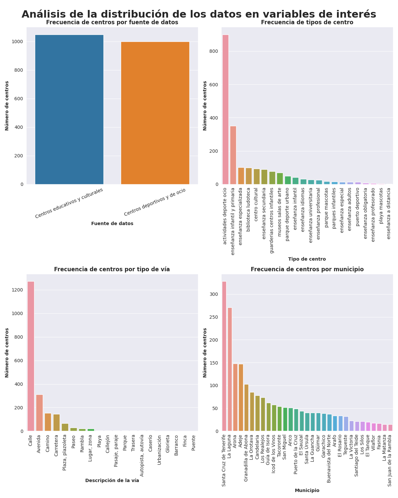
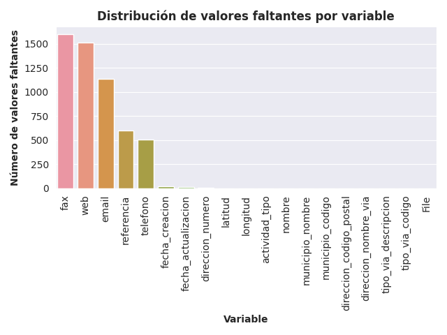

# Memoria del proyecto final

Asignatura: Web Semántica y Datos Enlazados.

Autor: Raúl Barba Rojas.

## Estructura del repositorio

En este repositorio se encuentran todos los recursos relacionados con el proyecto final de la asignatura. Concretamente, la estructura en carpetas se organiza del siguiente modo:

- 📂 data: este directorio contiene los datos utilizados en el proyecto. Tanto los originales, como los generados como resultado del proceso de transformación de datos y generación de datos en RDF.

    - 📂 original: este directorio contiene los datos originales (fuentes de datos originales) utilizados en el proyecto. Los datos pertenecen al Cabildo de Tenerife y pueden utilizarse bajo la licencia CC-By 4.0, por lo que en este sentido se atribuye todo el crédito al Cabildo de Tenerife por la recolección y publicación de estos conjuntos de datos tan útiles.

        - 📊 centros-deportivos-y-de-ocio-en-tenerife.csv: este fichero contiene los datos de la primera fuente de datos empleada, sobre centros deportivos y de ocio en Tenerife, en formato CSV. Proceden del Cabildo de Tenerife, y nos acogemos a la licencia para poder utilizarlos, dando todo el crédito al Cabildo de Tenerife.

        - 📊 centros-educativos-y-culturales-en-tenerife.csv: este fichero contiene los datos de la segunda fuente de datos empleada, sobre centros educativos y culturales en Tenerife, en formato CSV. Proceden del Cabildo de Tenerife, y nos acogemos a la licencia para poder utilizarlos, dando todo el crédito al Cabildo de Tenerife.

- 📂 eda: este directorio contiene información sobre el análisis exploratorio de datos realizado. Concretamente, contiene un subdirectorio con imágenes relacionadas con el análisis realizado, así como un notebook de Python con el código necesario para generar dichas imágenes. Este análisis también se realizó con Open Refine, aunque el proyecto final de Open Refine no se incluye en este directorio.

    - 📂 imgs: este directorio contiene las imágenes más destacadas generadas en el análisis de datos (no contiene todas, pues muchas de las imágenes no se persisten, únicamente se persiste el proceso realizado para llegar a sus resultados en la memoria).

        - 🖼️ data_distribution.png: esta figura representa la distribución de datos de algunas variables de interés del conjunto de datos, y permite adquirir una mayor comprensión de los mismos.

        - 🖼️ nulls_distribution.png: esta figura muestra la distribución de valores faltantes en las diferentes variables del conjunto de datos, lo que es especialmente útil para analizar posibles problemas en los datos.

    - 📓 exploratory_data_analysis.ipynb: el notebook de Python con el código necesario para adquirir ciertos insights de utilidad, desarrollados en el análisis de datos realizado.

- ℹ️ README.md: un fichero con toda la información sobre el proyecto final de la asignatura, incluyendo la estructura del repositorio, así como la memoria desarrollada del proyecto.

## Introducción

En este documento se presenta la memoria del proyecto final de esta asignatura sobre la web semántica y los datos enlazados del *Máster Universitario en Investigación en Inteligencia Artificial de la AEPIA*.

Dicho proyecto consiste en seleccionar y transformar un conjunto de datos, para obtener como resultado de las diferentes tareas aplicadas en este proceso un conjunto de datos enlazados, siguiendo la metodología estudiada en la asignatura. Para describir de forma efectiva el proceso realizado para lograr llevar a cabo este proceso de transformación de datos tradicionales a datos enlazados, este documento se estructura como sigue:

- **Proceso de transformación**: esta primera sección contiene todo el proceso de transformación de los datos (originalmente no enlazados) hacia un conjunto de datos enlazados, describiendo mediante subsecciones todas las etapas de este proceso, como podrían ser la selección de la fuente de datos, el análisis de los mismos, o incluso la creación de una ontología que de soporte a los datos (considerando los vocabularios ya existentes de la web semántica). 

- **Aplicación y explotación**: esta segunda sección contiene el proceso de aplicación y explotación de los datos enlazados generados en el proceso anterior. Así, es esta sección la que describe el prototipo funcional de aplicación que accede y explota los datos enlazados generados con anterioridad.

- **Conclusiones**: tras lo anterior, se ofrece una sección de conclusiones y lecciones aprendidas durante el desarrollo del proyecto final, a modo de resumen sobre todo el proceso realizado en la práctica.

- **Bibliografía**: la sección final contiene recursos bibliográficos empleados para el desarrollo de la práctica en cualquiera de los aspectos anteriores, desde el proceso de transformación hasta la propia explotación de los datos enlazados generados.

## Proceso de transformación

En esta sección de la memoria se describe detalladamente el proceso seguido para la transformación de un conjunto de datos no enlazado en un conjunto de datos enlazados. En la práctica, este proceso requirió la realización de diferentes tareas, de modo que esta sección se organiza en diferentes subsecciones:

- **Selección de la fuente de datos**: el primer paso del proceso de transformación realizado consistió en la selección de la fuente de datos que sería transformada a datos enlazados, interconectados con el resto de la web semántica. Así, en esta subsección se puede encontrar el conjunto de datos empleado, así como su origen.

- **Análisis de datos**: tras seleccionar el conjunto de datos a transformar, se llevó a cabo un proceso de análisis sobre los mismos explicando el tipo de licencia de los datos, así como el tipo de licencia del conjunto de datos enlazados que se obtuvo mediante este proceso. Este análisis de datos incluyó también el análisis necesario para obtener la información necesaria sobre el conjunto de datos para poder llevar a cabo su transformación y explotación de manera adecuada.

- **Estrategia de nombrado**: en esta otra subsección se describe la estrategia de nombrado empleada para el desarrollo de este proceso. Así, los diferentes elementos del vocabulario, así como las instancias del conjunto de datos enlazados generado, siguen la estrategia de nombrado definida en esta subsección.

- **Desarrollo del vocabulario**: esta subsección contiene toda la información relacionada con la creación del vocabulario necesario para dar soporte a los datos y poder crear el conjunto de datos enlazados. En este proceso se tuvieron también en cuenta aquellos vocabularios ya existentes en la web semántica, para re-utilizar aquellas clases y/o propiedades que ya hayan sido creadas en otros vocabularios ya existentes.

- **Proceso de transformación**: tras lo anterior, se llevó a cabo un proceso de transformación de los datos orientado a limpiar los datos y adecuarlos a los requisitos necesarios para una explotación satisfactoria de los mismos. Así, toda la estrategia y desarrollo de tareas necesarias para limpiar los datos se describen en esta subsección.

- **Enlazado**: en esta subsección se describe la forma en la que se llevó a cabo el enlazado de los datos, indicando con qué fuentes externas se han enlazado los datos, así como la herramienta y el proceso seguido para enlazar los datos.

- **Publicación**: TBD

### Selección de la fuente de datos

La selección de la fuente de datos para la realización de este proceso de generación de datos enlazados se basó en una búsqueda de conjuntos de datos que satisfacieran una serie de requisitos definidos:

1. **Conjunto de datos del dominio socio-cultural**, y más concretamente del dominio de aspectos culturales y de ocio.

2. **Conjunto de datos disponibles y actualizados en la historia reciente**, para poder manejar datos cuya explotación tenga algún interés.

3. **Conjunto de datos en formato procesable automáticamente**, de modo que no haga falta una creación manual del conjunto de datos origen para llevar a cabo el proceso de enlazado (lo que facilita y reduce considerablemente el tiempo necesario para poder llevar a cabo el proyecto).

4. **Conjunto de datos que permita ser enlazado con vocabularios ya existentes en la web semántica**. Este requisito no necesariamente implica que todas las clases a generar del vocabulario sean reutilizables de otros ya existentes para crear los enlaces (por ejemplo), sino que más bien se refiere a que sea posible crear algún enlace con conjuntos de datos existentes, y que las entidades puedan ser lo más genéricas posibles para facilitar la **visibilidad** del conjunto de datos enlazados a generar mediante el proceso.

Estos requisitos fueron definidos con el objetivo de llevar a cabo un proyecto lo más realista posible, con datos reales, disponibles y procesables automáticamente, y que puedan ser fácilmente accesibles y visibles en la web semántica. De forma adicional, se buscó la utilización de un conjunto de datos de un dominio que fuera de interés para el desarrollador del proyecto ([Raúl Barba Rojas](https://github.com/RaulBarbaRojas)), por lo que también se restringió el abanico de conjuntos de datos a emplear en base a si trataban temáticas relacionadas con ocio y/o deporte, mis temas de interés.

Considerando los requisitos especificados con anterioridad, se seleccionaron los siguientes conjuntos de datos, pertenecientes a la página web oficial de datos abiertos del Cabildo de Tenerife y del sector público insular (con licencia CC BY 4.0, tal y como se describe en la sección de análisis de los datos):

- **Centros educativos y culturales en Tenerife**: un conjunto de datos sobre la localización de centros educativos y culturales en la ciudad de Tenerife. Este conjunto de datos se encuentra accesible en Internet en el [siguiente enlace](https://datos.tenerife.es/es/datos/conjuntos-de-datos/centros-educativos-y-culturales-en-tenerife?return=aHR0cHM6Ly9kYXRvcy50ZW5lcmlmZS5lcy9lcy9kYXRvcy9jb25qdW50b3MtZGUtZGF0b3M=), y el titular de los datos es el Cabildo de Tenerife (aunque estos aspectos se detallan completamente en la sección de Análisis de datos). Los datos se encuentran disponibles y descargables en CSV, formato que permite un procesado automático de los mismos, por lo que satisfacen todas las restricciones explicitadas anteriormente.

- **Centros deportivos y de ocio en Tenerife**: un conjunto de datos sobre la localización de centros deportivos y de ocio en esa misma ciudad. Es un conjunto de datos análogo al anterior, cuyo titular es nuevamente el Cabildo de Tenerife, datos abiertos bajo la misma licencia (CC BY 4.0), disponibles (en [este enlace](https://datos.tenerife.es/es/datos/conjuntos-de-datos/centros-deportivos-y-de-ocio-en-tenerife?return=aHR0cHM6Ly9kYXRvcy50ZW5lcmlmZS5lcy9lcy9kYXRvcy9jb25qdW50b3MtZGUtZGF0b3M=)) y descargables en formato CSV, por lo que, al igual que en el caso anterior, cumplen con todas las restricciones necesarias definidas anteriormente para la selección de datos.

En la etapa de selección de datos se decidió emplear ambos conjuntos de datos como la fuente de origen de datos para realizar el proceso de generación de datos enlazados con ellos. La principal razón de esta decisión es que utilizan la misma estructura y permitiría la creación de una aplicación (o, al menos, un prototipo funcional de aplicación) que explote los datos de forma óptima, posibilitando búsquedas de diferentes tipos de centros, orientados a diferentes actividades y no sólo de ciertas actividades concretas (como podrían ser las deportivas o las educativas por separado).

Finalmente, en la página web de datos abiertos del Cabildo de Tenerife (en [este enlace](https://datos.tenerife.es/es/datos/conjuntos-de-datos?filter[groups][0]=cultura-ocio)) cabe destacar que se encontraron otros datos que podrían haber sido de interés para el desarrollo del proyecto, sin embargo, el dominio de centros relacionados con actividades socio-culturales era de mayor interés para el autor del proyecto que otros dominios como las actividades culturales en sí mismas, lo que hizo que se tomara la decisión de utilizar los conjuntos anteriores. 

### Análisis de datos

Tal y como se describió en la sección anterior, se pretende llevar a cabo el proceso de transformación de datos no enlazados a la web semántica, a datos enlazados. Para ello, se seleccionaron dos fuentes a priori complementarias, que contienen datos relacionados con centros de actividades relevantes en el ámbito socio-cultural (centros educativos, centros deportivos y centros de ocio principalmente). El análisis de datos realizado se focalizó en el seguimiento de diferentes etapas:

1. **Análisis de la licencia de los datos**: el primer paso realizado en el análisis de datos es el análisis de la licencia de los mismos. Esto se debe a que, si no se dispone del permiso legal para utilizar los datos, no podríamos emplear las fuentes de datos seleccionadas para el proceso de transformación a datos enlazados que pretendemos realizar. Así, este fue el primer paso del análisis de datos realizado.

2. **Análisis de los metadatos asociados a las fuentes de datos**: posteriormente, se llevó a cabo un análisis sobre los metadatos asociados a las fuentes de datos, para intentar ganar la máxima información posible que facilite la transformación y explotación de los datos.

3. **Análisis exploratorio de los datos**: tras el proceso anterior, se llevó a cabo un estudio exploratorio de los datos para intentar identificar posibles problemas a resolver en el procesamiento de los datos (por ejemplo, valores nulos, erróneos, inconsistentes, etc.).

4. **Conclusiones del análisis de datos**: finalmente, se ofrecen unas conclusiones sobre el proceso de análisis de datos realizado, que sirvieron de guía para el resto del proceso de transformación y explotación de los datos.

#### Análisis de la licencia de los datos

Primeramente, el análisis de datos englobó un profundo análisis sobre la licencia de los mismos. Para ambos conjuntos de datos especificados anteriormente, observamos varios aspectos en común:

1. Los datos pertenecen a un organismo público que, concretamente, es el Cabildo de Tenerife.

2. El autor que ha publicado esos datos es el Servicio Técnico de Desarrollo Socioeconómico y Comercio (de dicho Cabildo).

3. Observamos que tiene una licencia Creative Commons Attribution (CC-By 4.0).

Analizando los términos legales de la licencia, podemos entender que los autores permiten re-distribuir y re-utilizar los datos sin ningún tipo de problema, siempre y cuando se atribuya el crédito a que los datos originales proceden de dicha entidad. De este modo y, dado que se pretende emplear ambos conjuntos de datos para la resolución de la práctica, aprovecho esta línea para atribuir el crédito de la creación y publicación de los conjuntos de datos originales al Cabildo de Tenerife, siendo estos conjuntos de datos empleados como la base sobre la cuál la transformación a datos enlazados se llevará a cabo.

#### Análisis de los metadatos asociados a las fuentes de datos

Considerando los metadatos asociados a las fuentes de datos, nos damos cuenta de que se adjunta una pequeña descripción para cada una de las fuentes de datos (textualmente):

1. **Centros deportivos y de ocio en Tenerife**: Relación de recursos georreferenciados relacionados con el deporte y ocio en la isla de Tenerife.

2. **Centros educativos y culturales en Tenerife**: relación de recursos georreferenciados relacionados con la educación y la cultura (centros educativos, centros socioculturales, bibliotecas, academias...) en la isla de Tenerife.

Además, observamos que ambos conjuntos de datos se encuentran en español, reciben actualizaciones semestrales, y fueron actualizados muy recientemente (05/01/2024), lo que es una situación ideal para garantizar que la explotación de los datos nos puede permitir crear aplicaciones útiles y de interés real (aplicaciones prácticas).

Sin embargo, los metadatos no son demasiado descriptivos del esquema empleado por los conjuntos de datos, por lo que el análisis exploratorio de datos no recibió información adicional (que hubiera sido de interés) para su realización.

#### Análisis exploratorio de los datos

Tras lo anterior, se llevó a cabo un análisis exploratorio de los datos, con el fin de adquirir información y conocimiento sobre los mismos, con los que guiar los siguientes procesos para finalmente conseguir datos enlazados. La primera tarea llevada a cabo fue la de comparar los esquemas de ambos conjuntos de datos, pues ambos fueron elegidos debido a su similitud. Así, primeramente era necesario determinar si realmente eran esquemas parecidos (o incluso iguales), o si por el contrario eran muy diferentes, lo que implicaría que el proceso de selección de datos anterior no estuvo bien realizado.

Considerando ambos conjuntos de datos, y mediante el empleo de la herramienta *Open Refine*, podemos determinar que ambos conjuntos de datos tienen exactamente el mismo esquema de datos, que es el siguiente:

- `actividad_tipo`: este campo representa el tipo de actividad que se lleva a cabo en el centro deportivo. Contiene datos en formato textual (datos categóricos).

- `nombre`: es el nombre del centro en el que se llevan a cabo actividades (sean culturales, educativas, de ocio o incluso deportivas). Nuevamente, contiene datos en formato textual (variable categórica).

- `tipo_via_codigo`: es el código que representa el tipo de vía. Nuevamente, son datos textuales (variable categórica). Con respecto a este campo (y sin entrar todavía en los datos concretos que se puedan tener en las fuentes de datos empleadas), es de vital importancia entender el significado de los códigos, por lo que este esquema debe ser complementado con una tabla que traduzca cada código por el significado (tipo de vía) que representa.

- `tipo_via_descripcion`: es una descripción textual del tipo de vía, que facilita la comprensión del código anterior. Si bien con la utilización de este campo no sería 100% necesaria la creación de la tabla complementaria anterior (con el significado de los códigos), resulta de buena práctica indicar qué valores pueden tomar los campos, así como el significado de sus valores, por lo que esta tabla será generada con el propósito de facilitar la comprensión del conjunto de datos a generar.

- `direccion_nombre_via`: este campo representa el nombre de la vía (calle, zona o lugar, dependiendo del tipo de vía). Nuevamente, son datos textuales (variable categórica).

- `direccion_numero`: este campo representa el número de la vía donde se encuentra el centro. Es una variable categórica, pero ordinal (pues implica cierto orden, sin dejar de ser una variable categórica).

- `direccion_codigo_postal`: este campo representa el número o código postal, que identifica unívocamente la zona donde se encuentra el centro deportivo. Si bien toma valores numéricos, la variable es categórica (no cuantitativa, pues no expresa cantidades).

- `municipio_codigo`: este campo representa el código del municipio al que pertenece un centro determinado. Si bien es un campo con valores numéricos, nuevamente se trata de una variable categórica (pues no es cuantitativa).

- `municipio_nombre`: este campo representa el nombre del municipio al que pertenece un centro concreto. Es una columna similar a la anterior, con la diferencia de que en lugar de un código se emplea el nombre, que es más comprensible que un código.

- `referencia`: este campo representa una referencia a la localización del centro dentro de la vía. Por ejemplo, en una calle normal, representaría el número del edificio asociado al centro (si bien puede tomar otros significados en función de la vía - por ejemplo, en plazas o en playas toma valores diferentes, típicamente relacionados con el nombre del lugar en cuestión). Nuevamente, se trata de una variable categórica.

- `web`: es la web de referencia del centro. Nuevamente, una variable categórica.

- `email`: es el email de contacto con el centro. Nuevamente, variable categórica.

- `telefono`: es el teléfono de contacto del centro. Si bien el valor podría considerarse numérico, sigue siendo una variable categórica, puesto que no expresa cantidades.

- `fax`: es el FAX relacionado con el centro. Nuevamente, se trata de una variable categórica.

- `longitud`: es la coordenada de longitud que permite geolocalizar al centro. En este caso, se trata de una variable cuantitativa continua.

- `latitud`: es la coordenada de latitud que permite geolocalizar al centro. En este caso, se trata de una variable cuantitativa continua.

- `fecha_creacion` y `fecha_actualizacion`: estos campos no son excesivamente descriptivos, por lo que en un primer momento y sin mirar datos, parece prácticamente imposible determinar el significado de estos campos. Uno podría pensar que se refieren a la fecha de creación del centro, y la fecha de última actualización de sus datos, sin embargo, es únicamente una hipótesis y es algo que debe comprobarse analizando de forma más profunda los valores de estas columnas para diferentes centros.

En cualquier caso, observamos que:

1. Ambos conjuntos de datos disponen de la misma estructura, lo que facilita la operación de unión de los datos (fácilmente realizable con *Open Refine*), así como el análisis y transformación conjunta de los mismos.

2. Únicamente existe una columna que podría servir para nombrar unívocamente los centros: el nombre. Sin embargo, se requiere de un análisis más profundo (mirando datos y casuísticas concretas) para determinar si esta columna es o no válida para una posible estrategia de nombrado de recursos.

Gracias a la observación 1), se tomó la decisión de (tal y como se pensó originalmente) mezclar ambos conjuntos de datos con *Open Refine*, para hacer un análisis de datos conjuntos (como si fuera un único conjunto de datos con información de centros con diferente orientación en el ámbito socio-cultural, desde la educación hasta el deporte). Así, mediante *Open Refine* se creó un proyecto con ambos conjuntos de datos, lo que permitió visualizar el esquema anterior, junto con una nueva columna que fue añadida por el propio *Open Refine*: `File`, que representa el archivo de donde viene cada instancia del conjunto de datos. Esta última columna es francamente útil para clasificar por tipos los centros procedentes de cada fichero (tipos de alto nivel, que pueden especializarse mediante otras columnas como el tipo de actividad).

Tras este proceso anterior, se llevó a cabo el análisis exploratorio de datos propiamente dicho, empleando *Open Refine* para obtener los diferentes puntos de vista sobre los datos que ofrezcan información relevante para guiar el resto del proceso. Concretamente, hubo varios puntos del análisis realizado que arrojaron conclusiones interesantes:

- **Columna nombre**: como observamos anteriormente, la columna nombre es una gran candidata a columna a emplear para la estrategia de nombrado de las instancias en este conjunto de datos. Sin embargo, se realizó un análisis más profundo sobre los datos en esta columna, y observamos existencia de duplicados. Concretamente:

    - El valor "Parque calistenia" está duplicado 36 veces, y es el caso más destacado de duplicidad de nombre en el conjunto de datos. Esta duplicidad de nombre no implica la existencia de un registro duplicado, puesto que las direcciones de los centros son diferentes.

    - El valor "Gimnasio al aire libre" está duplicado 14 veces, y es un caso similar al anterior, donde la duplicidad no representa la existencia de instancias repetidas (en cuyo caso deberíamos mantener una y eliminar el resto, para evitar inconsistencias y tratamientos de datos innecesarios), pues las direcciones son diferentes en cada uno de estos centros deportivos.

    - El valor "Parque Infantil" se repite exactamente 7 veces, y es un caso análogo a los anteriores donde la dirección varía, pero el nombre se mantiene, lo que hace que esta columna adquiera valores duplicados.

    - Además de estos anteriores, existen unos pocos casos más de valores de nombre duplicados referidos a diferentes instancias de centros, lo que demuestra que dicha columna por sí sola no es útil como para identificar unívocamente a los centros (no sirve, por sí sola, para nombrar recursos). Esta pieza de información del análisis exploratorio de datos es francamente útil para guiar la estrategia de nombrado.

- **Tipos de vía (códigos)**: por otro lado, en el análisis exploratorio de datos se realizó un "facet de texto" sobre los datos de la columna `tipo_via_codigo` para identificar y normalizar (si fuera necesario) los códigos de los tipos de vía. Gracias a este análisis se detectaron inconsistencias a resolver durante la fase de transformación de los datos. Estas inconsistencias están relacionadas con un uso inconsistente de las mayúsculas. Así, códigos como "Cl" y "CL", referidos a vías de tipo "Calle" (información que sabemos gracias al campo `tipo_via_descripcion`) están presentes en el conjunto de datos, lo que no es una buena práctica, pues nos referimos a un mismo concepto con dos códigos diferentes (por un uso inconsistente de las mayúsculas). Estas incosistencias fueron arregladas en la fase de transformación de los datos, considerando el criterio de mantener el código en mayúsculas (la razón es que requiere cambiar menos instancias, lo que hace que la operación de transformación sea más ligera).

- **Distribución de ciertas variables de interés**: considerando ciertas variables de interés, como podrían ser la fuente de datos de procedencia de cada instancia, el tipo de vía, el tipo de centro o el municipio, se llevó a cabo un análisis sobre la distribución de los datos, de modo que se pudiera extraer información útil para el resto del proceso. La figura resultante de dicho análisis se muestra a continuación, y permite entender los siguientes aspectos:

    - **Similitud de tamaños entre fuentes de datos**: primeramente, observamos cómo ambas fuentes de datos contienen un número prácticamente idéntico de instancias (1049 centros culturales y educativos, respecto de 1001 centros deportivos y de ocio).

    - **Tipos de centros más frecuentes**: observamos cómo existen tipos de centros que son mucho más frecuentes que otros. Por ejemplo, el número de centros de enseñanza infantil y primaria es ampliamente mayor al número de centros de de enseñanza a distancia. Sin embargo, lo más destacable de la distribución calculada es que, dentro de los centros de deportivos y de ocio, hay un tipo de centro ampliamente utilizado que es el que lleva por nombre `actividades deporte ocio`. Simplemente son centros genéricos que permiten realizar actividades de deporte y ocio, y, dado que el nombre es ampliamente repetido y muy diferenciado de otros tipos de centros deportivos y de ocio (referidos a parques, puertos y playas, principalmente), podríamos llevar a cabo una transformación sobre este tipo de centro, cambiando el nombre del tipo de actividad a deporte/ocio, que parece más intuitiva que el nombre que nos viene originalmente en el conjunto de datos. Esta transformación se llevó a cabo en el proceso de transformación de datos.

    - **Tipos de vía más frecuentes**: por otro lado, también nos damos cuenta de que la mayoría de centros se encuentra en calles normales (lógico, por otra parte), pudiéndose también encontrar ampliamente en avenidas, caminos, carreteras y plazas. Por otro lado, observamos que existen puentes en lugares menos habituales, como puentes (lógicamente, la frecuencia de centros de cualquier tipo en este tipo de lugares es prácticamente nula).

    - **Municipios más frecuentes**: finalmente, observamos que existen municipios donde la cantidad de centros es ampliamente mayor a otros. Así, Santa Cruz de Tenerife o La Laguna contienen una gran cantidad de centros entre los dos (más de 600, esto es, más del 40% de los centros del conjunto de datos están en esos 2 municipios), mientras que otros municipios a penas contienen centros.

- **Análisis de datos textuales inconsistentes**: por otra parte, empleando Open Refine, se llevó a cabo un análisis orientado a determinar si existen valores inconsistentes en las columnas textuales (por ejemplo, un municipio igual, pero escrito diferente por algún motivo - como el empleo de mayúsculas). El análisis realizado permitió detectar que las columnas `tipo_via_codigo` y `direccion_numero` tienen valores inconsistentes que fueron tratados en el posterior proceso de transformación. Dichos valores inconsistentes están relacionados con el uso inconsistente de mayúsculas en el primer caso, y con uso inconsiste de nulos, mayúsculas y demás valores orientados a reflejar que un centro está en una dirección sin número (para homogeneizar, todos deberían ser nulos - cualquier criterio es válido realmente).

- **Columnas con datos erróneos**: más allá de los datos inconsistentes como los anteriores, también se detectaron datos erróneos. Es el caso de los teléfonos y los fax. Los datos de las fuentes de datos ofrecen valores de teléfonos y fax acabados en ".0" como si fueran decimales (cuando realmente son valores textuales). Además, el valor "0.0" se emplea para algunos casos en los que no hay telefóno (mientras que en otros se emplean los valores nulos, lo que a su vez crea no sólo errores, sino también inconsistencias en los datos). 

- **Fechas de creación y actualización**: considerando las fechas de creación y actualización, se analizaron los valores de dichas columnas para poder interpretar mejor su significado. Sin embargo, los resultados obtenidos muestran como las fechas de creación y actualización no son demasiado representativas, y no se corresponden con la idea inicial de la fecha de creación del centro y la fecha de su última actualización. En su lugar, podemos decir que más bien estas columnas están referidas a la fecha de creación y última actualización del registro relacionado con el centro.

|     **Columna**     |      **Mínimo**     |         **Máximo**         |
|:-------------------:|:-------------------:|:--------------------------:|
| fecha_creacion      | 2016-05-09 12:45:15 | 2023-11-02 12:51:29.751000 |
| fecha_actualizacion | 2015-08-03 12:27:40 | 2023-11-13 13:26:29.939000 |

- **Análisis de valores faltantes (nulos)**: por otro lado, el análisis exploratorio de datos también consideró un estudio enfocado a averiguar si las diferentes columnas del conjunto de datos de origen contenía valores nulos o faltantes. Dicho análisis queda perfectamente resumido en la siguiente figura, donde observamos que la variable fax es la que más valores faltantes tiene, con más de 1500 (únicamente un 25% de los centros del conjunto de datos disponen de fax). De forma similar ocurre con la página web, columna con un número de nulos también superior a 1500. En menor medida, las columnas email, referencia (referido a la referencia de la dirección si fuera necesaria - por ejemplo, cuando hay un número, por lo que tiene sentido que no haya una referencia para algunos centros) y también la columna de teléfono, que también tienen valores faltantes (aunque comprensible, pues no obligatoriamente los centros deben tener email o referencia o teléfono, pues quizá tengan teléfono pero no email, o viceversa, y, tal y como se explicó anteriormente, es posible que la referencia no sea necesaria, por lo que no es una situación que requiera una acción específica para resolverla, pues no es un problema sino más bien una circunstancia). Existe una ínfima cantidad de centros para los que no se dispone de fecha de creación y/o actualización, y el resto de columnas (las más relevantes realmente, como longitud y latitud, el nombre o el tipo de actividad) no disponen de valores faltantes, lo que facilita el procesamiento de los datos, pues no es necesario ningún tratamiento adicional en vista de lo observado en el análisis de valores faltantes.

Así, tras la realización del análisis de datos anterior, se completó una tabla resumen con información de soporte al resto de las etapas del proceso de transformación de datos no enlazados en datos enlazados:

| **Columna**             | **Tipo de datos** | **Comentarios y/o rango**                                                                                                                                                                                                                       | **Problemas encontrados**                                                                                                                                                                                                                                                                                                                                                                                                                                          |
|-------------------------|-------------------|-------------------------------------------------------------------------------------------------------------------------------------------------------------------------------------------------------------------------------------------------|--------------------------------------------------------------------------------------------------------------------------------------------------------------------------------------------------------------------------------------------------------------------------------------------------------------------------------------------------------------------------------------------------------------------------------------------------------------------|
| File                    | String            | Toma dos únicos valores representando los nombres de los ficheros relacionados con sendas fuentes de datos.                                                                                                                                     |                                                                                                                                                                                                                                                                                                                                                                                                                                                                    |
| actividad_tipo          | String            | Toma valores representando tipos de actividad. No hay único. No hay nulos.                                                                                                                                                                      | Cambiar el valor "actividades deporte ocio" por "deporte/ocio" para facilitar la comprensibilidad.                                                                                                                                                                                                                                                                                                                                                                 |
| nombre                  | String            | El nombre del centro. No hay nulos. No es único, aunque podría combinarse con el nombre de la dirección para crear un valor único.                                                                                                              |                                                                                                                                                                                                                                                                                                                                                                                                                                                                    |
| tipo_via_codigo         | String            | El tipo de vía en un código. No hay nulos. No es único.                                                                                                                                                                                         | Se han encontrado inconsistencias debido al uso inconsistente de mayúsculas. Por ejemplo: "CL" y "Cl" representan el tipo de vía "Calle" pero conforman dos códigos diferentes. Debe unificarse la nomenclatura de códigos.                                                                                                                                                                                                                                        |
| tipo_via_descripcion    | String            | La descripción del tipo de vía. No hay nulos. No es único.                                                                                                                                                                                      |                                                                                                                                                                                                                                                                                                                                                                                                                                                                    |
| direccion_nombre_via    | String            | El nombre de la vía donde se encuentra el centro. No hay nulos. No es único.                                                                                                                                                                    |                                                                                                                                                                                                                                                                                                                                                                                                                                                                    |
| direccion_numero        | String            | El número (si correspondiese) del centro en la vía concreta. Lógicamente hay nulos, puesto que hay vías donde el número no es relevante (por ejemplo, un paseo marítimo, un puerto o similares). No es único.                                   | Se han encontrado inconsistencias en la nomenclatura de aquellos centros que no tienen un número asociado a la vía donde se encuentran localizados. Algunos toman valor nulo, otros toman valor s/n, otros S/n, etc. Debe unificarse esta nomenclatura para mejorar la consistencia de los datos.                                                                                                                                                                  |
| direccion_codigo_postal | String            | El código postal de la zona donde se encuentra el centro. No hay nulos. No es único.                                                                                                                                                            |                                                                                                                                                                                                                                                                                                                                                                                                                                                                    |
| municipio_codigo        | String            | El código del municipio donde se encuentra el centro. No hay nulos. No es único.                                                                                                                                                                |                                                                                                                                                                                                                                                                                                                                                                                                                                                                    |
| municipio_nombre        | String            | El nombre del municipio (codificado en el campo anterior). No hay nulos. No es único. El análisis realizado concluyó que no hay inconsistencias en los nombres de los municipios (como ocurría con el código de tipo de vía).                   |                                                                                                                                                                                                                                                                                                                                                                                                                                                                    |
| referencia              | String            | Es la referencia de la dirección donde se encuentra el centro (dados el nombre de la vía y el número si corresponde). Así, la referencia es el "tercer nivel" de la dirección, pero no siempre es necesario, por lo que hay nulos. No es único. |                                                                                                                                                                                                                                                                                                                                                                                                                                                                    |
| web                     | String            | Es la web de contacto del centro, si la hubiese. Hay nulos. No es única, puesto que hay centros que comparten web, principalmente centros culturales que emplean la web del ayuntamiento.                                                       |                                                                                                                                                                                                                                                                                                                                                                                                                                                                    |
| email                   | String            | Es el email de contacto del centro, si lo hubiese. Hay nulos. No es único, puesto que hay centros que comparten email, tal y como ocurría en el caso anterior.                                                                                  | Todos los teléfonos acaban en ".0" como si fueran valores decimales, cuando realmente son valores textuales, lo que convierte automáticamente todos los teléfonos en teléfonos erróneos que deben arreglarse. Además, se emplea el valor "0.0" en algunos centros para referirse al hecho de que no se dispone de teléfono para el centro, mientras que en la gran mayoría se emplean los valores nulos, por lo que esta inconsistencia debe también ser reparada. |
| telefono                | String            | Es el teléfono de contacto del centro, si lo hubiese. Hay nulos, puesto que el centro no tiene por qué tener teléfono asociado. No es único, pues hay centros que comparten email.                                                              |                                                                                                                                                                                                                                                                                                                                                                                                                                                                    |
| fax                     | String            | Es el fax de contacto del centro, si lo hubiese. Hay nulos. No es único.                                                                                                                                                                        | Todos los fax acaban en ".0" como si fueran valores decimales, cuando realmente son valores textuales, lo que convierte automáticamente todos los fax en fax erróneos que deben arreglarse. Además, se emplea el valor "0.0" en algunos centros para referirse al hecho de que no se dispone de fax para el centro, mientras que en la gran mayoría se emplean los valores nulos, por lo que esta inconsistencia debe también ser reparada.                        |
| longitud                | Double            | Es la coordenada de longitud donde se encuentra geolocalizado el centro. No es nulo.                                                                                                                                                            |                                                                                                                                                                                                                                                                                                                                                                                                                                                                    |
| latitud                 | Double            | Es la coordenada de latitud donde se encuentra geolocalizado el centro. No es nulo.                                                                                                                                                             |                                                                                                                                                                                                                                                                                                                                                                                                                                                                    |
| fecha_creacion          | Datetime          | Es la fecha de creación del centro en el conjunto de datos (no en la realidad). Hay nulos, aunque en la gran mayoría de casos sí se dispone de esta información.                                                                                |                                                                                                                                                                                                                                                                                                                                                                                                                                                                    |
| fecha_actualizacion     | Datetime          | Es la fecha de última actualización del centro en el conjunto de datos (no en la realidad). Hay nulos, aunque en la gran mayoría de casos sí se dispone de esta información.                                                                    |                                                                                                                                                                                                                                                                                                                                                                                                                                                                    |
#### Estrategia de nombrado de recursos

Esta sección está orientada a la definición de la estrategia de nombrado empleada para nombrar los recursos tanto del vocabulario que se emplea para dar soporte semántico a los datos, como a las instancias del conjunto de datos.

Siguiendo las guías descritas en la asignatura, existen diferentes pasos que se deben seguir para definir correctamente la estrategia de nombrado de recursos:

1. **Elección de la forma de las URIs**: primeramente, se debe elegir la forma de las URIs, concretamente, primero se debe decidir si los identificadores de las URIs se separan mediante "#" o mediante "/". En el caso concreto de este proyecto final, considerando las circunstancias óptimas donde se deben aplicar cada uno de estos separadores, se considera la siguiente estrategia:

    1.1. **Forma de las URIs para elementos del vocabulario**: considerando los diferentes elementos del vocabulario (como las clases), se decide emplear el símbolo "#" para diferenciar el identificador del resto de la URI. La razón principal que justifica esta decisión es que los elementos del vocabulario son un número bajo y, además, no se esperan demasiados cambios en ellos (no son dinámicos, y no es un conjunto grande), por lo que la decisión más adecuada sería emplear el símbolo "#" de modo que cuando se vaya a obtener un elemento del vocabulario se obtendrá todo el fichero, y se buscará el elemento dentro del fichero.

    1.2. **Forma de las URIs para instancias del conjunto de datos**: a diferencia del caso anterior, para las instancias del conjunto de datos se decide emplear el símbolo "/" para separar el identificador del resto de la URI. En este caso, también existen unas razones que justifican la decisión. En primer lugar, las instancias del conjunto de datos son dinámicas, pues en la propia web se especifica que cada 6 meses aproxidamente se actualizan las instancias del conjunto de datos, sea para crear nuevas, o para modificar las ya existentes. Además, no sólo tenemos un conjunto de datos dinámico sino que el número de elementos es significativamente mayor (hablamos de miles de instancias), de modo que elegir el símbolo "#" tendría un mayor coste computacional (necesitaríamos obtener el mismo archivo para cada instancia, y buscarlo dentro de un conjunto de datos relativamente grande, lo que conlleva cierto coste computacional). Por estos motivos, se tomó la decisión de emplear el símbolo "/" para separar el identificador del resto de la URI en el nombrado de instancias del conjunto de datos.

2. **Elección del dominio de las URIs**: tras lo anterior, el siguiente paso fue elegir un dominio para las URIs. En este caso, se utilizó un dominio bajo nuestra disposición para las URIs: https://tenerifecenters.com/. (Nótese que este dominio es un dominio de ejemplo a nivel teórico, puesto que no se dispone de un servicio de hosting que proporcione un dominio real. En la implementación, se emplearán rutas referidas a `localhost` para cubrir la carencia del dominio real). 

3. **Elección de la ruta de la URI**: para facilitar la comprensión de las URIs, así como para establecer una clara separación entre los términos ontológicos y los individuos del conjunto de datos se emplean las siguientes rutas de URIs:

    3.1. **Ruta para términos ontológicos**: https://tenerifecenters.com/ontology/centers#. En dicha ruta, observamos como empleamos el símbolo "#" para referirnos a un elemento ontológico concreto (el "#" sería eliminado al hacer la petición, se obtendría el fichero completo, y se buscaría dentro del fichero el identificador que está separado por el símbolo "#").

    3.2. **Ruta para individuos del conjunto de datos**:  https://tenerifecenters.com/resources/. En este segundo caso, observamos como empleamos una ruta diferente a la anterior, para establecer la separación entre recursos ontológicos e instancias del conjunto de datos. Además, en este caso, empleamos el símbolo "/" para identificar los individuos (centros), pues el conjunto de datos es dinámico y relativamente grande.

4. **Definición de patrones**: finalmente, se definen los patrones para los diferentes elementos de interés:

    4.1. **Patrón de URI para individuos**: https://tenerifecenters.com/resources/<resource_type>/<resource_identifier>. En el caso de individuos del conjunto de datos, empleamos el patrón anterior, en el que empleamos la ruta "resources" para, dentro de ella, indicando el tipo de recurso y el identificador del mismo, poder referirnos a un individuo concreto del conjunto de datos. Este identificador único debería ser la combinación de `nombre` y `direccion_nombre_via`, que debe ser única para todas las instancias del conjunto de datos.

    4.2. **Patrón para términos ontológicos**: en lo que respecta a términos de la ontología (donde podríamos tener propiedades y clases, por ejemplo), se define el siguiente patrón de URIs: https://tenerifecenters.com/ontology/centers#<term_name>. Como se puede ver, dentro de la ruta de "ontology" disponemos de un fichero con la ontología, en el que se definen los diferentes elementos ontológicos cuyo nombre debemos especificar (#<term_name>) para poder referirnos a ellos y poder emplearlos una vez definido el vocabulario.

#### Desarrollo del vocabulario

El desarrollo del vocabulario implicó la realización de diferentes tareas:

1. **Especificación de requisitos**: primeramente, se llevó a cabo la especificación de requisitos que el vocabulario a crear debía cumplir.

2. **Extracción de términos**: tras lo anterior, se llevó a cabo la extracción de términos, empleando los requisitos anteriores, pero también los datos y su esquema. Además, este glosario de términos se extendió con los sinónimos de los términos identificados, para desarrollar un vocabulario lo más completo posible.

3. **Elaboración de la conceptualización**: finalmente, se elaboró la conceptualización considerando todo lo anterior, estableciendo las jerarquías necesarias, las relaciones entre elementos ontológicos, etc.

4. **Búsqueda de ontologías**: se emplearon herramientas propias de la web semántica, como LOV, para buscar ontologías existentes en el dominio deseado.

5. **Selección de ontologías**: la selección de ontologías se llevó a cabo teniendo en cuenta lo bien que cubren el dominio en que trabajamos, posibles problemas que puede conllevar su empleo, así como su utilización en otros conjuntos de datos enlazados.

6. **Implementación de la ontología**: la implementación de la ontología, parte clave de todo el proceso, se llevó a cabo a través de la herramienta Protégé.

7. **Evaluación de la ontología**: finalmente, se llevó a cabo la evaluación de la ontología con herramientas existentes, como el razonador de Protégé.

Así, el primero de los pasos fue la especificación de requisitos que debían cumplirse en la ontología a desarrollar:

- **Reutilización de conceptos y diseños ya existentes**: primeramente, se definió el requisito de emplear, en la medida de lo posible, conceptos ya existentes que puedan re-utilizarse de otros vocabularios, o que permitan crear enlaces para la mayor disponibilidad del conjunto de datos enlazados a generar. 

- **Implementación del vocabulario en formato soportado por Open Refine**: por otro lado, se tiene el requisito de implementar el vocabulario en un formato estandarizado, como podría ser un fichero en sintaxis RDF/XML o Turtle (creado con herramientas como Protégé), de modo que pueda cargarse en Open Refine (de extremada importancia la carga desde fichero, pues no se dispone de un dominio ni de un servidor que aloje este vocabulario para que Open Refine lo utilice).

Tras la definición de estos requisitos, se llevó a cabo la creación de un glosario de términos con los aspectos necesarios para dar soporte semántico a los datos que se obtuvieron de las fuentes de datos. Se definen en la siguiente tabla:

| **Término**  | **Ontología**                            | **Clase**      |
|--------------|------------------------------------------|----------------|
| Centro       | https://schema.org/                      | CivicStructure |
|              | https://saref.etsi.org/saref4city/       | Facility       |
|              | http://vivoweb.org/ontology/core#        | Building       |
| Dirección    | http://www.w3.org/ns/locn#               | Address        |
|              | http://www.w3.org/2006/vcard/ns#         | Address        |
| Localización | http://www.w3.org/2003/01/geo/wgs84_pos# | Point          |
| Municipio    | http://schema.org/                       | Place          |
|              | http://rdfs.co/juso/                     | Township       |                                                                                                                                                                                                                  

Como se puede ver, en esta etapa previa a la implementación de la ontología se ha creado un glosario con términos y sus sinónimos (descritos entre paréntesis), de modo que se puedan buscar estos conceptos en ontologías ya existentes (si puede ser, ontologías estándares en este dominio) en la web semántica.

Así, tras definir el glosario de términos, se buscaron estos conceptos en vocabularios existentes, obteniendo el resultado descrito en la siguiente tablas (en blanco para casos donde no se encontró una ontología existente para cubrir el concepto). La primera de ellas muestra las clases encontradas (dentro de sus respectivas ontologías) que podrían ayudarnos a cubrir los conceptos que requerimos, mientras que la segunda está referida a las propiedades:

| **Término**  | **Ontología**                            | **Clase**      |
|--------------|------------------------------------------|----------------|
| Centro       | https://schema.org/                      | CivicStructure |
|              | https://saref.etsi.org/saref4city/       | Facility       |
|              | http://vivoweb.org/ontology/core#        | Building       |
| Dirección    | http://www.w3.org/ns/locn#               | Address        |
|              | http://www.w3.org/2006/vcard/ns#         | Address        |
| Localización | http://www.w3.org/2003/01/geo/wgs84_pos# | Point          |
| Municipio    | http://schema.org/                       | Place          |
|              | http://rdfs.co/juso/                     | Township       |
