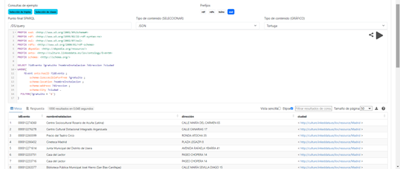

# Memoria del proyecto final

Asignatura: Web Semántica y Datos Enlazados.

Autor: Rosa Cristina Ruiz Rivas.

## 1 Introducción

Se realizaron pruebas con los datos del LCC Council. Se parte de los datos contenidos en data/206974-0-agenda-eventos-culturales-100.csv proporcionado por munimadrid para eventos culturales y actividades. Se depuran los datos, se obtienen los recursos y se adapta el vocabulario, buscando en ontologías términos reutilizables. Se busca crear una ontología propia y enlazarlos con datos externos.

## 2 Proceso de transformación
En la memoria se explica el proceso de realización de la práctica. 

## 2.a Selección de la fuente de datos

Se probó con los datos ofrecidos por Council energy consumption, en data.gov.UK de electricidad y gas, de 2010-2013 y por falta de permisos de licencia. Se optó por los datos de munimadrid de la agenda de eventos culturales desde un fichero csv disponible en:[enlace](https://datos.madrid.es/portal/site/egob/menuitem.c05c1f754a33a9fbe4b2e4b284f1a5a0/?vgnextoid=6c0b6d01df986410VgnVCM2000000c205a0aRCRD&vgnextchannel=374512b9ace9f310VgnVCM100000171f5a0aRCRD&vgnextfmt=default)

## 2.b Análisis de datos

- `ID-EVENTO`: Tipo string e identificadores únicos.
- `TITULO`: Se comprobó que los eventos tuvieran horarios distintos. Son de tipo string.
- `PRECIO`: Columna eliminada por no contener prácticamente ningún precio de entrada disponible.
- `GRATUITO`: Binario que indica si el evento es gratuito o no.
- `LARGA-DURACION`: Binario que indica su duración.
- `DIAS-SEMANA`: Disponibilidad del evento. Son de tipo string.
- `DIAS-EXCLUIDOS`: Depuración por no contener información de interés.
- `FECHA`, `FECHA-FIN`, `HORA`: Fecha del evento. Son de tipo fecha/hora.
- `DESCRIPCION`: Depuración por no ser atributo de interés.
- `ACCESIBILIDAD-INSTALACIÓN`: Dato entero que nos indica el tipo de accesibilidad.
- `CLASE-VIAL-INSTALACION`,`NOMBRE-VIA-INSTALACION` ,`NUM-INSTALACION`: Son de tipo string y el último de tipo entero. Se agrupan las columnas y se les asigna el nombre Dirección.
- `BARRIO-INSTALACION`: Barrio del centro de actividades. Son de tipo string.
- `CODIGO-POSTAL-INSTALACION`: Son de tipo entero.
- `COORDENADA-X`: Coordenada de 6 caracteres sobre plano de la ciudad. Son de tipo entero.
- `COORDENADA-Y`: Coordenada de 7 caracteres sobre plano de la ciudad. Son de tipo entero.
- `LATITUD`, `LATITUD` : Eliminadas por contenido redundante.
- `TIPO`: Son recursos que nos indican el tipo de actividad. Son de tipo string. 

- **Licencia**
- Autorización de reutilización y cesión no exclusiva de derechos de propiedad intelectual.
- Permiten la reutilización de los documentos y datos sometidos a ellas para fines comerciales y no comerciales.
- Origen de los datos: Ayuntamiento de Madrid.
- Fecha de la última actualización de los documentos objeto de la reutilización:"2024-02-09T17:18:49Z".
- Esta licencia podría distribuirse bajo la licencia: CC BY-SA 4.0.

## 2.c Estrategia de nombrado de recursos

Se deben definir los recursos en función del mapping. A partir de ellos se indicará el vocabulario que da soporte semántico y los datos instanciados. Se tiene que recuperar el recurso.
Para elegir la forma de las URIs se emplea el hash # para identificar a partir del fragmento el valor que se corresponde con cada recurso. Su uso nos permite acceder a todos los datos con una única petición HTTP. Es útil en las ontologías para acceder al vocabulario. Así se obtiene dicho vocabulario según el fichero csv escogido de los eventos culturales. Nos indica que las URIs son persistentes. 

El slash / se emplea para el acceso por grupos a bases de datos relacionales de manera dinámica a través de la API. Se emplea para el acceso completo a los datos. Con ello se pueden distribuir entre varios servicios.

En la elección del dominio de las URIs se parte de la ruta por defecto: http://127.0.0.1:3333/

- Se elige como base de la URI el siguiente dominio: http://culture.linkedata.es/
- Ruta para términos ontológicos: http://culture.linkedata.es/lov/ontology/Event#
- Ruta para individuos del conjunto de datos: http://culture.linkedata.es/lov/resource/
- Patrón para términos ontólogicos: http://culture.linkedata.es/lov/ontology/Event#<term_name>
- Patrón para individuos: http://culture.linkedata.es/lov/resource/<resource_type>/<resource_name>

## 2.d Desarrollo del vocabulario

Se extraen los términos identificados a partir del esquema y los datos. Se busca en linkedata los conceptos que mejor encajen con nuestro proyecto. Se debe reutilizar la mayor cantidad de conceptos en función de los sinónimos, adaptados a los términos de nuestro vocabulario. Para ello se deben mirar con detenimiento los filtros del vocabulario de https://lov.linkeddata.es/dataset/lov/vocabs.

A partir de un sujeto se establecen las relaciones. Nos podemos basar en la clase CivicStructure. En función de los datos proporcionados y el RDF que los soporta en formato Turtle, el sujeto más apropiado es Event. Según los conceptos que nos planteamos se deben definir las siguientes clases como se explica en el siguiente apartado.
La ontología se encuentra en la ruta para términos ontólogicos.
Preguntas de competencia funcionales:
- ¿En qué recinto tendrá lugar el evento?
- ¿Cual es la dirección y en qué ciudad?
- ¿El evento cultural es gratuito?
- ¿Cual es la duración del evento?

Con ello los datos individuales se recogen en ID-EVENTO que será único para cada evento y similar al uprn, TITULO, LARGA-DURACION, FECHA, FECHA-FIN, HORA, DIRECCION, DISTRITO-INSTALACION, BARRIO-INSTALACION, CIUDAD, CÓDIGO-POSTAL-INSTALACIÓN, COORDENADA-X, COORDENADA-Y.
    
- ***Creación de una ontología***
    Se parte de las tripletas con sus sujetos propiedades y objetos. La Semántica Ontológica es una teoría del significado que tiene como base una ontología, un generador de conocimiento a partir de los textos que se analizan y un generador de lenguaje basado en una representación concreta del significado. La ontología o base de conocimiento es una forma de entender el dominio de los eventos culturales de Madrid.

## 2.e Proceso de transformación

Hay que realizar un mapping en base al vocabulario que plantearemos.
Se emplea OpenRefine para realizar un cluster a partir de Facet y eliminar los ID-EVENTO nulos, tras haberlos transformado para que comenzaran con cuatro 0. Se comprueba el nº de eventos gratuitos y el nº de eventos de larga duración, para ver si hay algún elemento no binario.  Se crea la columna DIRECCION a partir de join>columns, uniendo CLASE-VIAL-INSTALACIÓN, NOMBRE-VIA-INSTALACION, NUM-INSTALACIÓN. 

Con ello se edita el esqueleto o esquema de RDF en OpenRefine, en función del desarrollo del vocabulario.
Se usa TITULO como URI con grel "Event/"+value. Es un lenguaje funcional.
Se define la propiedad hasID a partir del prefijo onto que define la ontología. Se asocia al ID_EVENTO único de tipo texto. TITULO sería el sujeto, hasID sería el predicado e ID-EVENTO el objeto o la clase. A partir de la búsqueda de linkeddata se define la semántica más apropiada al vocabulario planteado. 

Las propiedades fueron buscadas con detenimiento y seleccionadas en http://schema.org a partir de linkeddata y en dbpedia.owl.
A continuación se exponen las propiedades y los conceptos más relevantes aplicables a nuestro conjuntos de datos, tras filtrarlos por relevancia. Se transforma el esqueleto :
- schema:isAccesibleForFREE -> GRATUITO: Nos indica la gratuidad del evento, que es contenido booleano.
- schema:duration -> LARGA-DURACION: Duración del evento diaria o semanal, que es contenido booleano.
- schema:Startdate -> FECHA: Fecha de inicio del evento, que es contenido de tipo Date/time.
- schema:endDate -> FECHA-FIN: Fecha de cierre del evento, que es contenido de tipo Date/time.
- schema:location -> NOMBRE-INSTALACION: Edificio donde se realiza el evento o la actividad.
- schema:address -> DIRECCION: Lugar donde se realiza el evento cultural que es contenido de tipo texto.
- schema:City -> CIUDAD: Ciudad donde se realiza el evento cultural que es contenido de tipo texto.
- dbpedia-owl:district -> DISTRITO-INSTALACION: Distrito donde se ubica la instalación donde se realiza el evento.
- schema:longitude -> COORDENADA-X: localización en dirección este y oeste del recinto donde se ubica el evento.
- schema:latitude -> COORDENADA-Y:localización en dirección norte y sur del recinto donde se ubica el evento.
El barrio de la instalación se borra tras el proceso de linkado por no ser barrios conocidos y no encontrarse en linkedata, el vocabulario adecuado para los mismos.

En última instancia se cambiaron los nombres de los títulos de mayúsculas a minúsculas, para adaptarlo a la consulta query SPARQL del apartado de aplicación y explotación. Posteriormente se han cambiado los formatos de las fechas, con grel.
- value.replace('T', ' ')
- value.replace('Z', ':00')


## 2.f Enlazado de datos

Dentro de nuestro dataset transformado, se identifica la clase Madrid cuyos datos pueden ser enlazados. Consiste en encontrar qué conjuntos de datos contienen instancias. Se emplea Openrefine para llevar acabo el enlazado. Se busca un dataset disponible y bien documentado para que se generen datos entrantes. Se ejecuta un servicio de reconciliación dbpedia.es basado en SPARQL endpoint dentro de OpenRefine tanto en origen como en destino.

La columna elegida en origen es ciudad que se añade a partir de la dirección, en concreto a partir del barrio de la instalación. Existen 1001 instancias de valor Madrid. A partir de los identificadores de esta columna, se crea una única variable para todas las celdas idénticas, haciendo un auto-match con alta confianza. Se crea una nueva columna ciudadDataLinked, con los datos de wikidata, un dataset externo que habla de ciudades. En nuestro caso concreto se relaciona con Madrid.


En ese momento reconciliamos con http://www.wikidata.org/wiki/Q2807, según se observa en la clase ciudadDataLinked.
Para alinear las instancias entre ciudad y ciudadDataLinked se emplea owl:sameAs. De este modo quedan alineados por instancias los enlaces de destino con nuestro dataset de origen. 
Esto se observa en la figura.

 

 De esta manera, según el patrón de individuos: <http://culture.linkeddata.es/lov/resource/Madrid>, el recurso Madrid queda enlazado con el recurso Madrid de la wiki de wikidata. En esta solución se añade el servicio de reconciliación basado en SPARQL endpoint llamado DBPedia.es con es.dbpedia.org/sparql. SPARQL es un lenguaje de consulta sobre RDFs, soportado por las APIs. Permite combinar en la misma consulta elementos pertenecientes a los datos y al esquema. Permite a los usuarios hacer consultas usando SPARQL. 

## 2.g Publicación

Se podría acceder y explotar los datos enlazados en http://dbpedia.org/ontology/city. Se pueden publicar los datos como RDF. Los recursos quedarían enlazados en http://dbpedia.org/resource/Madrid. Estos recursos son los conjuntos de datos y el vocabulario exportado del fichero turtle final.
La URI asociada sería https://dbpedia.org/ontology/city#Madrid.
Pueden distribuirse bajo la licencia CC BY-SA 4.0. También están publicados en Github.

## 3. Aplicación y explotación

He aplicado Apache Jena Fuseki versión 5.0 tras descomprimirlo y ejecutarlo desde línea de comandos con ./fuseki-server.bat.
Se ejecuta en el servidor como una aplicación web utilizando http://localhost:3030/. Se ha cargado en el DS el fichero turtle como dataset del proyecto.

Permite hacer consultas query SPARQL sobre propiedades de un recurso. En este proyecto se usa la propiedad onto: hasID. La consulta que resuelve es: "Partiendo del sujeto formado por la URI con el título del evento, dime si la ontología tiene un identificador de evento único para cada uno de los eventos".
```
PREFIX xsd: <http://www.w3.org/2001/XMLSchema#>
PREFIX rdf: <http://www.w3.org/1999/02/22-rdf-syntax-ns>
PREFIX owl: <http://www.w3.org/2002/07/owl>
PREFIX rdfs: <http://www.w3.org/2000/01/rdf-schema>
PREFIX dbpedia: <http://dbpedia.org/resource/>
PREFIX onto: <http://culture.linkeddata.es/lov/ontology/Event#>
PREFIX schema: <http://schema.org/>

SELECT ?idEvento
WHERE{ 
	?Event onto:hasID ?idEvento ;
} 
```
Se adjunta a continuación la salida del código.


 Así se establece un patrón de búsqueda sobre el grafo RDF. Con ello se accede al identificador de cada evento, como se ve en el fichero Turtle Agenda-eventos-culturales-final.ttl. Además se accede al vocabulario, una vez se han acoplado los datos a la estructura planteada, de cada evento de Madrid, a partir de schema. Se enlazan con el dataset de salida. Ofrece al usuario final la información precisa del nombre de la instalación asociada al identificador del evento, la dirección y el patrón de individuos asociados a Madrid. Se muestra el código.
```
PREFIX xsd: <http://www.w3.org/2001/XMLSchema#>
PREFIX rdf: <http://www.w3.org/1999/02/22-rdf-syntax-ns>
PREFIX owl: <http://www.w3.org/2002/07/owl>
PREFIX rdfs: <http://www.w3.org/2000/01/rdf-schema>
PREFIX dbpedia: <http://dbpedia.org/resource/>
PREFIX onto: <http://culture.linkeddata.es/lov/ontology/Event#>
PREFIX schema: <http://schema.org/>

SELECT ?idEvento ?nombreInstalacion ?direccion ?ciudad
WHERE{ 
	?Event onto:hasID ?idEvento ;
       	schema:location ?nombreInstalacion ;
        schema:address ?direccion ;
		schema:City ?ciudad .
} 
```
Para resolver las preguntas de competencia funcionales se utilizan las querys SPARQL que hemos visto en la figura del recinto, la dirección y la ciudad.


- ¿El evento cultural es gratuito? 
```
PREFIX xsd: <http://www.w3.org/2001/XMLSchema#>
PREFIX rdf: <http://www.w3.org/1999/02/22-rdf-syntax-ns>
PREFIX owl: <http://www.w3.org/2002/07/owl>
PREFIX rdfs: <http://www.w3.org/2000/01/rdf-schema>
PREFIX dbpedia: <http://dbpedia.org/resource/>
PREFIX onto: <http://culture.linkeddata.es/lov/ontology/Event#>
PREFIX schema: <http://schema.org/>

SELECT ?idEvento ?gratuito ?nombreInstalacion ?direccion ?ciudad
WHERE{ 
	?Event onto:hasID ?idEvento ;
        schema:isAccesibleForFree ?gratuito ;
       	schema:location ?nombreInstalacion ;
        schema:address ?direccion ;
		schema:City ?ciudad .
  FILTER(?gratuito = '1')
} 
```
Se observa en la siguiente figura los eventos que lo cumplen.



- ¿Cual es la duración del evento? 
Se indican a continuación los eventos que cumplen ser diarios o semanales.
```
PREFIX xsd: <http://www.w3.org/2001/XMLSchema#>
PREFIX rdf: <http://www.w3.org/1999/02/22-rdf-syntax-ns>
PREFIX owl: <http://www.w3.org/2002/07/owl>
PREFIX rdfs: <http://www.w3.org/2000/01/rdf-schema>
PREFIX dbpedia: <http://dbpedia.org/resource/>
PREFIX onto: <http://culture.linkeddata.es/lov/ontology/Event#>
PREFIX schema: <http://schema.org/>

SELECT ?idEvento ?largaDuracion ?nombreInstalacion ?direccion ?ciudad
WHERE{ 
	?Event onto:hasID ?idEvento ;
        schema:duration ?largaDuracion ;
       	schema:location ?nombreInstalacion ;
        schema:address ?direccion ;
		schema:City ?ciudad .
  FILTER(?largaDuracion = '1')
} 
```
Y su figura correspondiente:


A continuación se muestran los que cumplen los dos últimos requisitos.
```
PREFIX xsd: <http://www.w3.org/2001/XMLSchema#>
PREFIX rdf: <http://www.w3.org/1999/02/22-rdf-syntax-ns>
PREFIX owl: <http://www.w3.org/2002/07/owl>
PREFIX rdfs: <http://www.w3.org/2000/01/rdf-schema>
PREFIX dbpedia: <http://dbpedia.org/resource/>
PREFIX onto: <http://culture.linkeddata.es/lov/ontology/Event#>
PREFIX schema: <http://schema.org/>

SELECT ?idEvento ?gratuito ?largaDuracion ?nombreInstalacion ?direccion ?ciudad
WHERE{ 
	?Event onto:hasID ?idEvento ;
        schema:isAccesibleForFree ?gratuito ;
        schema:duration ?largaDuracion ;
       	schema:location ?nombreInstalacion ;
        schema:address ?direccion ;
		schema:City ?ciudad .
  FILTER(?gratuito = '1' && ?largaDuracion = '1' )
} 
```
En la figura se muestran los resultados de los eventos gratuitos con larga duración.


La ontología se implementa en RDF en el fichero Agenda-eventos-culturales-final.rdf. Nos aporta un conjunto de conceptos y clases en una estructura jerárquica en torno al dominio de evento, que es la clase principal, que se disgrega en las clases gratuito, duración, fecha en que empieza, fecha en que termina, localización y ciudad. A partir de estos conceptos se generan individuos que serán instancias de cada una de estas clases dentro del nivel de datos.


## 4. Conclusiones

Tras lo anterior, se ofrece una sección de conclusiones y lecciones aprendidas durante el desarrollo del proyecto final, a modo de resumen sobre todo el proceso realizado en la práctica. Los contenidos de web semántica y datos enlazados nos lleva a construir este proyecto de eventos de madrid y una ontología en base a la misma a partir del sujeto evento. Ha sido una ardua tarea entre localizar las bases de datos, transformarlos a la semántica adecuada y enlazar las distintas bases de datos. Se adaptan los datos de munimadrid, se analizan la licencia y la fuente de datos, se transforman para adecuarlos a los patrones y rutas para términos ontológicos e individuos buscando la ontología más apropiada. 

Posteriormente se enlazaron el dataset con el dataset externo de wikidata con Madrid. He aprendido bastante sobre el enlazado de datos en este proyecto. He comprendido cómo publicar, realizar una publicación y explotar el vocabulario dentro de un proyecto concreto.

## 5. Bibliografía

 La sección final contiene recursos bibliográficos empleados para el desarrollo de la práctica en cualquiera de los aspectos anteriores, desde el proceso de transformación hasta la propia explotación de los datos enlazados generados.

Contenido del curso: Web Semántica y datos enlazados.

https://www.w3.org/TR/turtle/

https://www.w3.org/TR/rdf-schema/

https://github.com/charlesvardeman/fuseki-docker/blob/master/config.ttl

https://lov.linkeddata.es/dataset/lov/

https://www.w3.org/2001/XMLSchema

https://jena.apache.org/documentation/fuseki2/

https://www.freecodecamp.org/espanol/news/como-formatear-codigo-en-markdown/
